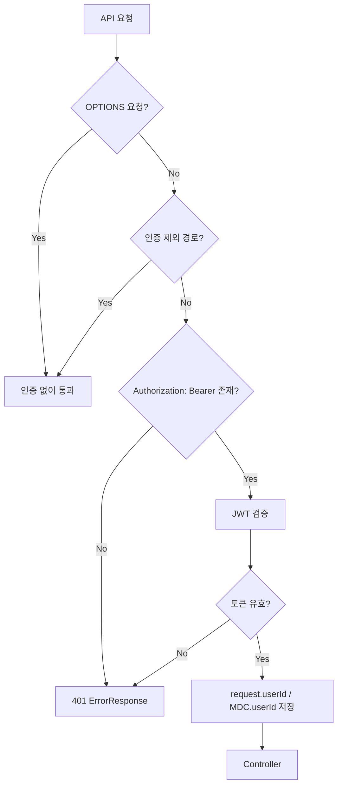
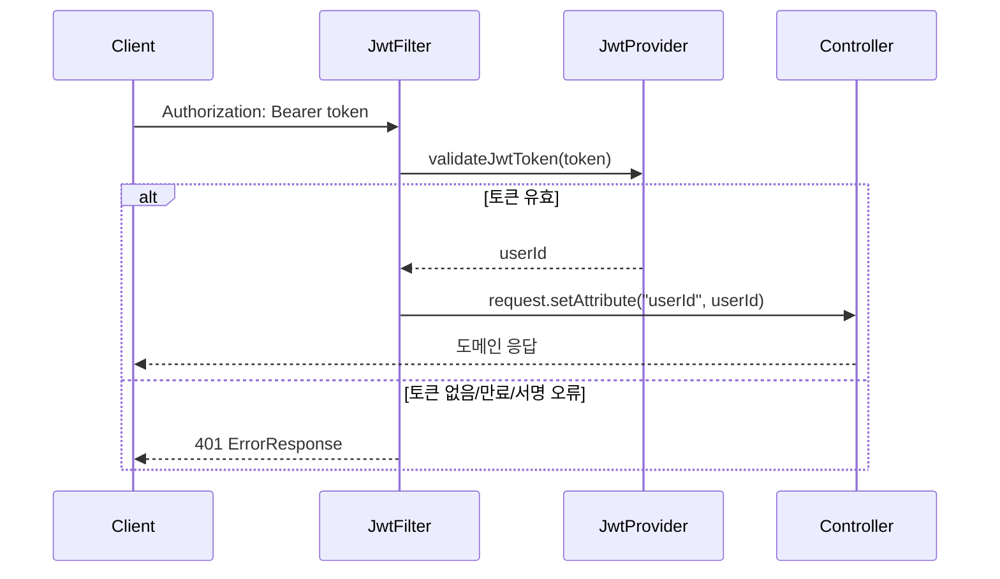
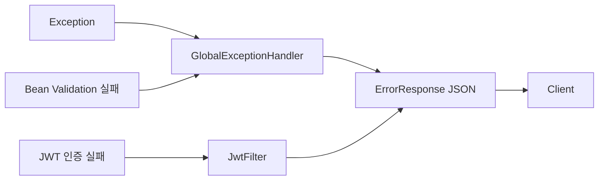

# API 공통 규격

이 문서는 OLma 백엔드 API 전반에 공통으로 적용되는 인증, 에러 응답, 문서화 경로를 정리한다. 요청/응답 스키마 전체는 [운영 API OpenAPI 스냅샷](https://olma-web.github.io/OLma-Docs/artifacts/openapi-2026-08-01.json)에 보존되어 있다.

---

## 1. 기본 경로

| 구분 | 경로 |
|------|------|
| OpenAPI JSON | `/v3/api-docs` |
| 보존된 OpenAPI 스냅샷 | `https://olma-web.github.io/OLma-Docs/artifacts/openapi-2026-08-01.json` |
| Actuator Health | `/actuator/health` |
| Prometheus Metrics | `/actuator/prometheus` |

비즈니스 API는 현재 `/v1` prefix를 사용한다.

---

## 2. 인증 방식

인증이 필요한 API는 `Authorization` 헤더에 Bearer 토큰을 전달한다.

```http
Authorization: Bearer <JWT>
```

`JwtFilter`는 토큰 검증에 성공하면 JWT에서 추출한 `userId`를 `HttpServletRequest` attribute와 MDC에 저장한다.

```java
request.setAttribute("userId", userId);
MDC.put("userId", String.valueOf(userId));
```

컨트롤러는 필요한 경우 아래 방식으로 인증 사용자를 확인한다.

```java
Long userId = (Long) httpRequest.getAttribute("userId");
```



### 인증 요청 시퀀스



---

## 3. 인증 제외 경로

아래 경로와 `OPTIONS` 요청은 JWT 검증 없이 통과한다.

| 경로 | 용도 |
|------|------|
| `/v1/auth/` | 회원가입, 로그인 등 인증 진입점 |
| `/v3/api-docs` | OpenAPI JSON |
| `/actuator` | Health, Prometheus 등 운영 엔드포인트 |
| `OPTIONS` | CORS preflight |

`@SecurityRequirement`는 OpenAPI 문서에 인증 필요 여부를 표시하기 위한 문서화 어노테이션이다. 실제 인증 여부는 `JwtFilter`의 인증 제외 경로가 결정한다.

---

## 4. 공통 에러 응답

전역 예외 처리와 JWT 인증 실패 응답은 `ErrorResponse` 구조를 사용한다.

```json
{
  "timestamp": "2026-07-16T15:00:00+09:00",
  "status": 400,
  "error": "Bad Request",
  "message": "Validation failed",
  "path": "/v1/submissions",
  "fieldErrors": [
    {
      "field": "amount",
      "message": "must be greater than or equal to 10"
    }
  ]
}
```

`fieldErrors`는 Bean Validation 실패처럼 필드 단위 오류가 있을 때만 포함된다. JSON 직렬화는 null 필드를 제외한다.



---

## 5. 주요 상태 코드

| 상태 코드 | 의미 | 대표 발생 조건 |
|-----------|------|----------------|
| 400 | Bad Request | Bean Validation 실패, 잘못된 참조 ID, 도메인 검증 실패 |
| 401 | Unauthorized | 토큰 없음, 토큰 형식 오류, 만료/유효하지 않은 JWT |
| 403 | Forbidden | 권한이 없는 요청 |
| 404 | Not Found | 리소스 없음, 조회 대상이 아닌 숨김 상태 |
| 409 | Conflict | 중복 값, DB 제약 조건 충돌 |
| 500 | Internal Server Error | 처리되지 않은 서버 예외 |

### 권한/존재 여부 응답 정책

| 상황 | 권장 응답 | 현재 관찰된 사용 예 |
|------|-----------|--------------------|
| 인증 토큰이 없거나 유효하지 않음 | 401 | `JwtFilter`에서 공통 처리 |
| 인증은 되었지만 작업 권한이 없음 | 403 | 단가 제보/커뮤니티 수정·삭제 시 소유권 실패 |
| 리소스가 없거나 조회 대상이 아님 | 404 | 존재하지 않는 ID, HIDDEN 상태 단가 제보 |
| 중복 이메일 등 제약 충돌 | 409 | `DuplicateValueException`, `DataIntegrityViolationException` |

403과 404는 권한 실패와 리소스 부재를 구분하기 위해 사용한다. 인증된 사용자가 리소스에 대한 작업 권한이 없으면 403, 리소스가 없거나 숨김 상태라 조회 대상이 아니면 404를 반환한다.

---

## 6. 날짜/시간 응답

`OffsetDateTime` 응답 필드는 `KstOffsetDateTimeSerializer`를 통해 KST 오프셋으로 직렬화된다.

```json
"createdAt": "2026-07-16T15:00:00+09:00"
```

로그 패턴도 KST 오프셋을 포함한 ISO-8601 형태를 사용한다.

---

## 7. CORS

현재 `WebConfig`는 모든 경로에 대해 아래 정책을 적용한다.

| 항목 | 값 |
|------|----|
| allowedOriginPatterns | `*` |
| allowedMethods | `GET`, `POST`, `PUT`, `DELETE`, `PATCH`, `OPTIONS` |
| allowedHeaders | `*` |
| allowCredentials | `true` |
| maxAge | `3600` |

운영 환경에서도 동일하게 적용되는 현재 정책이다.

---

## 관련 문서

- [단가 제출 API 가이드](./rate-submission)
- [아키텍처 개요](../development/architecture-overview)
- [로깅 구현 레퍼런스](../observability/logging)
