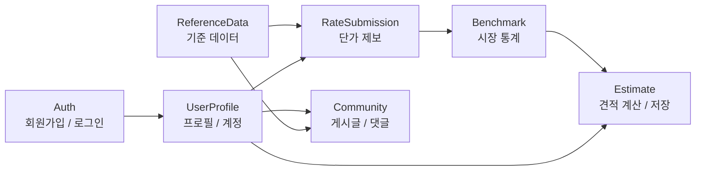

# 도메인별 API 요약

이 문서는 OLma 백엔드 API를 컨트롤러/도메인 단위로 빠르게 파악하기 위한 요약 문서다. 상세 요청/응답 스키마는 Swagger UI와 OpenAPI JSON을 기준으로 확인한다.

기준 코드: `src/main/java/com/olma/controller/*Controller.java`  
공통 규칙: [API 공통 규격](./common)

## 전체 도메인 지도

## 인증 정책 요약

| 구분 | 인증 |
| --- | --- |
| `/v1/auth/signup`, `/v1/auth/login` | 불필요 |
| `/swagger-ui`, `/v3/api-docs`, `/actuator` | 불필요 |
| 그 외 비즈니스 API | 필요 |

인증이 필요한 요청은 `Authorization: Bearer <JWT>` 헤더를 사용한다. 실제 인증 여부는 Swagger 어노테이션이 아니라 `JwtFilter`의 인증 제외 경로가 결정한다.

## 도메인별 요약

| 도메인 | Base path | 목적 | 주요 사용 화면 |
| --- | --- | --- | --- |
| Auth | `/v1/auth` | 회원가입, 로그인, 로그아웃 | 로그인, 회원가입 |
| UserProfile | `/v1/users` | 프로필 조회/수정, 제출 이력, 비밀번호 변경, 회원 탈퇴 | 설정, 대시보드, 커리어, 온보딩 |
| ReferenceData | `/v1/reference` | 직무, 경력, 자격증 등 기준 데이터 조회 | 온보딩, 대시보드, 커뮤니티 필터 |
| RateSubmission | `/v1/submissions` | 단가 제보 생성/조회/수정/숨김 | 온보딩, 커리어 |
| Benchmark | `/v1/benchmark` | 시장 단가 통계와 사용자 단가 비교 | 대시보드 |
| Estimate | `/v1/estimates` | 견적 계산, 저장, 프로젝트명 수정, 협상 시뮬레이션 | 견적, 커리어 |
| Community | `/v1/community` | 게시글/댓글 CRUD, 좋아요, 신고, 내 활동 조회 | 커뮤니티, 내 활동 |

## Auth API

| Method | Path | 인증 | 설명 |
| --- | --- | --- | --- |
| `POST` | `/v1/auth/signup` | 불필요 | 회원가입 |
| `POST` | `/v1/auth/login` | 불필요 | 로그인 및 JWT 발급 |
| `POST` | `/v1/auth/logout` | 필요 | 로그아웃 응답 처리 (`204 No Content`) |

## UserProfile API

| Method | Path | 설명 |
| --- | --- | --- |
| `GET` | `/v1/users/{userId}` | 사용자 프로필 조회 |
| `GET` | `/v1/users/me/profile` | 인증 사용자 프로필 조회 |
| `PUT` | `/v1/users/{userId}/profile` | 사용자 프로필 수정 |
| `PUT` | `/v1/users/me/profile` | 인증 사용자 프로필 수정 |
| `PATCH` | `/v1/users/me/profile/spec-progress` | 프로필 스펙 진행 상태 수정 |
| `GET` | `/v1/users/{userId}/submissions` | 사용자 단가 제출 이력 조회 |
| `PUT` | `/v1/users/me/password` | 비밀번호 변경 |
| `DELETE` | `/v1/users/me` | 회원 탈퇴 |

## ReferenceData API

| Method | Path | 설명 |
| --- | --- | --- |
| `GET` | `/v1/reference/job-categories` | 직무 카테고리 조회 |
| `GET` | `/v1/reference/work-types` | 근무 유형 조회 |
| `GET` | `/v1/reference/regions` | 지역 조회 |
| `GET` | `/v1/reference/experience-levels` | 경력 레벨 조회 |
| `GET` | `/v1/reference/certificate-types` | 자격증 유형 조회 |

ReferenceData는 단순 조회 성격이 강해 현재 Service 계층 없이 Repository를 직접 사용한다. 이 패턴은 [아키텍처 개요](../development/architecture-overview)에 별도 기록되어 있다.

## RateSubmission API

| Method | Path | 설명 |
| --- | --- | --- |
| `POST` | `/v1/submissions` | 단가 제보 생성 |
| `GET` | `/v1/submissions/{id}` | 단가 제보 단건 조회 |
| `PATCH` | `/v1/submissions/{id}/project-name` | 프로젝트명 수정 |
| `DELETE` | `/v1/submissions/{id}` | 단가 제보 숨김 처리 |

이 도메인은 현재 상세 정책 문서가 별도로 있다. 자세한 소유권/소프트 삭제/정규화 규칙은 [단가 제출 API 가이드](./rate-submission)를 참고한다.

## Benchmark API

| Method | Path | Query | 설명 |
| --- | --- | --- | --- |
| `GET` | `/v1/benchmark` | `jobCategoryId`, `experienceLevelId`, `workFormat`, `userAmount` | 조건별 시장 단가 통계 조회 |

Benchmark는 단가 제보 데이터를 기반으로 사용자 단가의 상대 위치를 보여주는 읽기 전용 API다.

## Estimate API

| Method | Path | 설명 |
| --- | --- | --- |
| `POST` | `/v1/estimates/calculate` | 견적 계산 |
| `POST` | `/v1/estimates/negotiation/simulate` | 협상 시뮬레이션 계산 |
| `POST` | `/v1/estimates` | 견적 계산 후 저장 |
| `GET` | `/v1/estimates` | 내 저장 견적 목록 조회 |
| `GET` | `/v1/estimates/{id}` | 내 저장 견적 단건 조회 |
| `PATCH` | `/v1/estimates/{id}/project-name` | 저장 견적 프로젝트명 수정 |
| `PATCH` | `/v1/estimates/{id}/negotiation-simulation/start` | 협상 시뮬레이션 시작 표시 |
| `PATCH` | `/v1/estimates/{id}/negotiation-simulation/progress` | 협상 시뮬레이션 진행 상태 저장 |
| `PATCH` | `/v1/estimates/{id}/negotiation-simulation/complete` | 협상 시뮬레이션 완료 |
| `DELETE` | `/v1/estimates/{id}` | 저장 견적 삭제 |

Estimate는 프론트엔드의 스마트 견적 계산기와 커리어 보관함에서 함께 사용된다.

## Community API

| Method | Path | 설명 |
| --- | --- | --- |
| `GET` | `/v1/community/posts` | 게시글 목록 조회 |
| `GET` | `/v1/community/me/posts` | 내가 쓴 글 조회 |
| `GET` | `/v1/community/me/comments` | 내가 쓴 댓글 조회 |
| `POST` | `/v1/community/posts` | 게시글 작성 |
| `GET` | `/v1/community/posts/{postId}` | 게시글 상세 조회 |
| `PUT` | `/v1/community/posts/{postId}` | 게시글 수정 |
| `DELETE` | `/v1/community/posts/{postId}` | 게시글 숨김 처리 |
| `POST` | `/v1/community/posts/{postId}/likes` | 게시글 좋아요 |
| `DELETE` | `/v1/community/posts/{postId}/likes` | 게시글 좋아요 취소 |
| `POST` | `/v1/community/posts/{postId}/comments` | 댓글/대댓글 작성 |
| `PUT` | `/v1/community/comments/{commentId}` | 댓글 수정 |
| `DELETE` | `/v1/community/comments/{commentId}` | 댓글 숨김 처리 |
| `POST` | `/v1/community/comments/{commentId}/likes` | 댓글 좋아요 |
| `DELETE` | `/v1/community/comments/{commentId}/likes` | 댓글 좋아요 취소 |
| `POST` | `/v1/community/posts/{postId}/reports` | 게시글 신고 |
| `POST` | `/v1/community/comments/{commentId}/reports` | 댓글 신고 |

Community는 엔드포인트 수가 가장 많은 도메인이다. 추후 상세 문서가 필요해지면 목록/상세/작성/수정/삭제/좋아요/신고를 별도 정책 문서로 분리한다.

## 문서화 상태

| 도메인 | 현재 문서화 수준 | 후속 작업 |
| --- | --- | --- |
| 공통 API | 상세 문서 있음 | 유지 |
| RateSubmission | 상세 문서 있음 | 권한 정책 개선 시 갱신 |
| Auth/User/Reference | 요약 수준 | 변경 시 Swagger와 이 문서 갱신 |
| Benchmark | 요약 수준 | 통계 계산 정책 문서화 검토 |
| Estimate | 요약 수준 | 견적 계산 정책 문서화 검토 |
| Community | 요약 수준 | 상세 정책 문서 추가 검토 |

## 관련 문서

- [API 공통 규격](./common)
- [단가 제출 API 가이드](./rate-submission)
- [프론트엔드 API 연동](../frontend/api-integration)
- [요청 처리 흐름](../development/request-flow)
