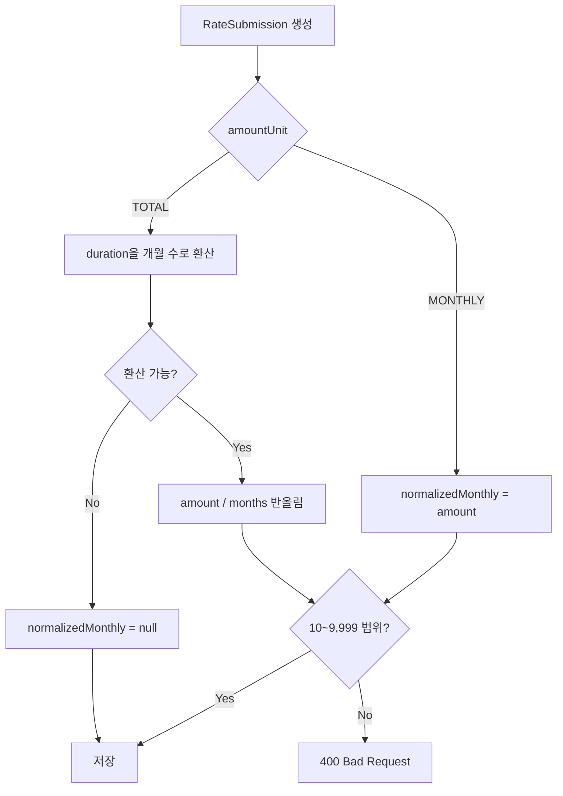
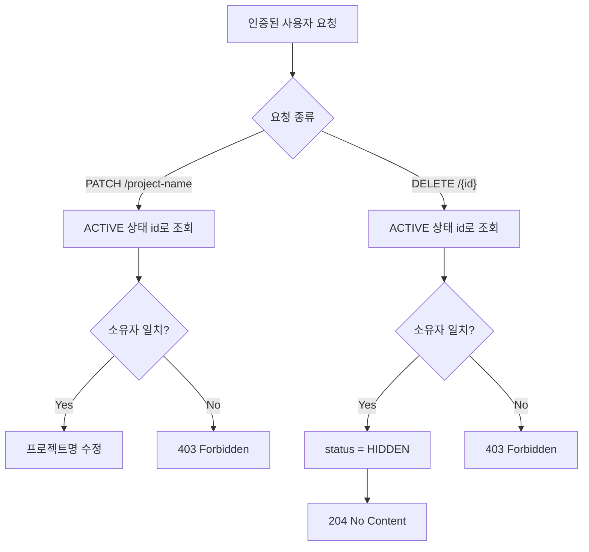
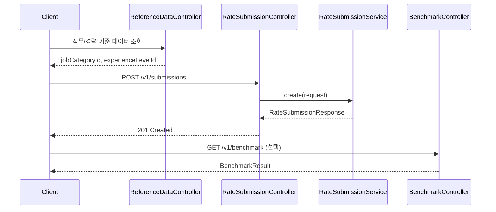

# 단가 제출(RateSubmission) API 가이드 & 비즈니스 정책

> 💡 **Swagger vs 본 문서의 차이점**
> - **Swagger (`/swagger-ui.html`, `/v3/api-docs`):** 요청/응답 DTO 스펙, HTTP 메서드 등 기술적 입출력 규격 확인용.
> - **본 문서:** Swagger 필드 설명만으로는 안 보이는 비즈니스 규칙(Rule), 도메인 간 연동 흐름(Flow), 예외 처리 정책 확인용.

기준 코드: `RateSubmissionController.java`, `RateSubmissionService.java`, `RateSubmission.java` (2026-07 기준)

---

## 1. 도메인 핵심 비즈니스 규칙 (Business Policies)

### 인증 정책
`RateSubmissionController`의 `/v1/submissions` 경로는 `JwtFilter`의 인증 제외 경로에 포함되지 않는다. 따라서 **조회(GET)를 포함한 4개 엔드포인트 전부** `Authorization: Bearer <JWT>`가 필요하다. 컨트롤러의 `@SecurityRequirement(name = "BearerAuth")`는 이 동작을 Swagger UI에 표시하기 위한 문서화 어노테이션이다.

### userId 폴백 규칙
`RateSubmissionController.create()`:

```java
if (request.getUserId() == null) {
    request.setUserId((Long) httpRequest.getAttribute("userId"));
}
```

생성 요청 바디에 `userId`를 명시하면 그 값을 그대로 쓴다. 비워두면 인증 필터가 JWT에서 추출해 `HttpServletRequest`에 심어둔 `userId` 속성으로 채운다. 비로그인 상태(속성 자체가 없음)라면 최종적으로 `null`로 저장된다.

### 단가 검증 및 정규화 규칙
- Bean Validation: `amount`는 `@Min(10)` — 10 미만이면 400.
- 서비스 레이어(`RateSubmissionService.create()`): 환산 월 단가(`normalizedMonthly`)가 계산되면 10~9,999 범위를 벗어날 때 400.
- `normalizedMonthly` 계산 로직 (`RateSubmission.calculateNormalizedMonthly()`) — Swagger 스키마로는 드러나지 않는 의미론적 규칙:
  - `amountUnit = MONTHLY`: `normalizedMonthly = amount`
  - `amountUnit = TOTAL`: `normalizedMonthly = amount / 환산개월수` (HALF_UP 반올림)
  - `duration` 문자열이 아래 표에 없거나 파싱 실패 시: `normalizedMonthly = null` (범위 검사 자체를 건너뜀)

| `duration` 값 | 환산 개월 수 |
|----|-------------|
| `1주일 이하` | 0.25개월 |
| `2~3주` | 0.625개월 |
| `1개월` | 1개월 |
| `2~3개월` | 2.5개월 |
| `3개월 이상` | 3개월 |
| 숫자 문자열 | 해당 숫자를 개월 수로 파싱 |



### 소유권 정책 — PATCH와 DELETE



| 작업 | 소유권 확인 기준 | 실패 시 응답 | 현재 동작 |
|------|------------------|--------------|-----------|
| 프로젝트명 수정 | ACTIVE 상태의 `submission.id` 조회 후 `request.userId` 비교 | 403 | 본인 소유 제보만 수정 가능 |
| 삭제 | ACTIVE 상태의 `submission.id` 조회 후 `request.userId` 비교 | 403 | 본인 소유 제보만 숨김 처리 |
| 단건 조회 | ACTIVE 상태의 `submission.id` | 404 | HIDDEN 상태는 반환하지 않음 |

---

## 2. API 연동 시나리오

```text
[ReferenceData 조회] → [RateSubmission 생성] → [Benchmark 조회] (선택)
```



1. 클라이언트는 `ReferenceDataController`(`/v1/reference/job-categories`, `/v1/reference/experience-levels`)에서 유효한 `jobCategoryId`/`experienceLevelId`를 얻는다. `RateSubmissionRequest`의 두 필드는 `@NotNull`이며, 존재하지 않는 ID를 넣으면 400(`Invalid job category`/`Invalid experience level`)이 반환된다.
2. 위 ID로 `POST /v1/submissions`를 호출해 단가를 제보한다.
3. 같은 `jobCategoryId` 등으로 `BenchmarkController`(`GET /v1/benchmark`)를 호출하면 시장 통계를 조회할 수 있다. 다만 이 호출은 방금 만든 제보와 서버 측에서 연결되지 않는다 — 단순히 같은 참조 데이터를 공유할 뿐이다.

---

## 3. 엔드포인트 요약

| 메서드 | 경로 | 인증 | 설명 |
|--------|------|------|------|
| `POST` | `/v1/submissions` | 필요 | 단가 제보 생성 |
| `GET` | `/v1/submissions/{id}` | 필요 | ACTIVE 단가 제보 단건 조회 |
| `PATCH` | `/v1/submissions/{id}/project-name` | 필요 | 프로젝트명 수정 (본인 소유만) |
| `DELETE` | `/v1/submissions/{id}` | 필요 | 소프트 삭제 (본인 소유 ACTIVE 제보만) |

요청/응답 필드의 전체 스키마는 Swagger UI(`/swagger-ui.html`, 백엔드 서버 경로)에서 확인한다. `RateSubmissionRequest`/`RateSubmissionResponse`에는 `projectName`(선택, 최대 100자) 필드도 포함된다.

**참고 — 소프트 삭제의 실제 동작:** `delete`는 물리 삭제가 아니라 `RateSubmission.hide()`를 통해 `status`를 `HIDDEN`으로 바꾸는 소프트 삭제다. `RateSubmissionService.getById()`는 ACTIVE 상태만 조회하므로, 삭제(숨김) 처리된 제보는 ID를 알아도 404로 응답한다.

---

## 4. 오류/예외 처리

| HTTP 상태 | 발생 조건 |
|-----------|-----------|
| 400 | `amount < 10`, 필수 필드 누락(Bean Validation), 존재하지 않는 `jobCategoryId`/`experienceLevelId`, 또는 `normalizedMonthly`가 10~9,999 범위를 벗어남 |
| 401 | JWT 미제공 또는 유효하지 않은 JWT |
| 403 | PATCH/DELETE 요청자가 제보 소유자가 아님 |
| 404 | 해당 `id`의 ACTIVE 제보가 없음 |

### 제한 사항 및 후속 개선

| 항목 | 현재 동작 | 위험 | 후속 개선 |
|------|-----------|------|-----------|
| `SubmissionType` 의미 | `TRACK_A`, `TRACK_B` 이름만 존재 | 클라이언트/문서에서 의미 해석 어려움 | 도메인 용어로 리네임하거나 Swagger 설명 보강 |

---

## 관련 문서

- [프로젝트 개요](/) — 전체 도메인 지도에서 단가 제출이 차지하는 위치
- [데이터 모델](/development/data-model) — RateSubmission과 기준 데이터/사용자 관계
- Swagger UI (`/swagger-ui.html`) — 요청/응답 스키마 전체 명세
