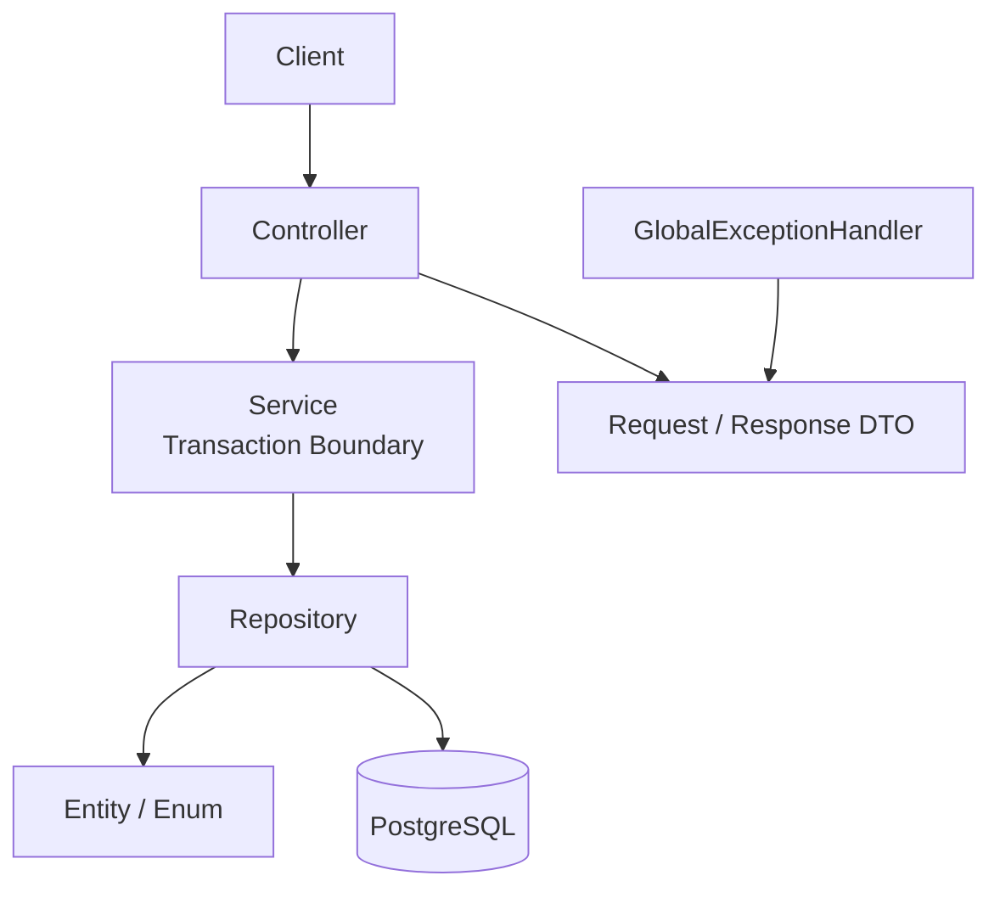
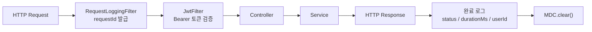
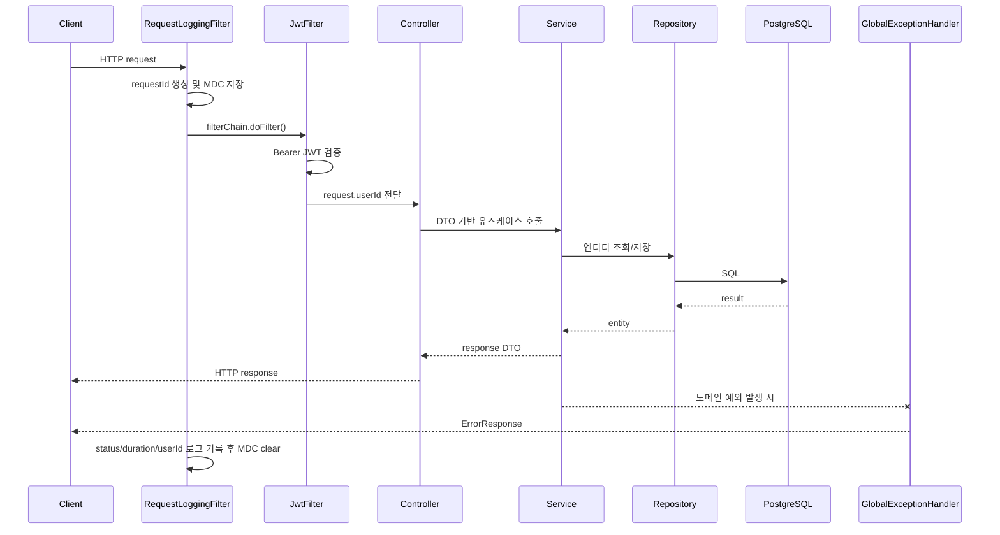

# 아키텍처 개요

이 문서는 코드에서 실제로 관찰되는 구조와 컨벤션을 기술한다. 팀이 명시적으로 합의한 "설계 원칙" 문서가 아니라, **지금 코드가 실제로 이렇게 동작한다**는 사실 중심의 기록이다.

기준 코드: `config/`, `controller/`, `service/`, `domain/`, `dto/`, `exception/` 패키지 전체 (2026-07 기준)

---

## 1. 레이어 구조

본 프로젝트는 단일 애플리케이션 내에 모든 도메인이 포함된 모놀리식(Monolithic) 구조를 취하고 있으며, 내부적으로는 계층 간 가독성과 격리성을 확보하기 위해 표준 레이어드 아키텍처(Layered Architecture)를 채택하고 있다. (`settings.gradle.kts` 기준 단일 Gradle 모듈, `bootJar` 단일 산출물, [단일 Docker 컨테이너로 배포](../ops/deploy).)

```text
src/main/java/com/olma/
├── config/      # 필터, 인증, CORS, Jackson, Swagger 등 애플리케이션 전역 설정
├── controller/  # HTTP 요청 진입점 — @RestController
├── service/     # 트랜잭션 단위 비즈니스 로직
├── domain/      # 엔티티, 레포지토리, 열거형
├── dto/         # 요청/응답 DTO
└── exception/   # 커스텀 예외 클래스
```

각 레이어의 기본 흐름은 `Controller → Service → Repository/Entity` 순이며, Service가 트랜잭션(`@Transactional`) 경계를 갖는다.



:::info[레이어링 예외 — ReferenceDataController]
`ReferenceDataController`(직무 카테고리/근무 형태/지역/경력/자격증 조회)만 Service 계층 없이 Repository를 직접 주입받아 사용한다. 단순 조회 전용이라는 이유로 보이지만, 다른 컨트롤러와 다른 패턴이므로 이 도메인을 수정할 때는 Service 계층을 새로 만들지, 기존 패턴을 유지할지 먼저 확인이 필요하다.
:::

---

## 2. 인증 및 요청 진입 필터 아키텍처

### 2.1 필터 체인 흐름

```text
클라이언트 요청
  → RequestLoggingFilter (@Order 1)   -- requestId 발급, MDC 세팅, 응답 후 접근 로그 기록
  → JwtFilter (@Order 2)              -- Bearer 토큰 검증, userId 추출
  → Controller
```



`RequestLoggingFilter`(`config/RequestLoggingFilter.java`)가 먼저 실행되어 `requestId`를 MDC에 심고, 응답이 끝나면 상태 코드에 따라 info/warn/error 레벨로 접근 로그를 남긴다(`status >= 500` → error, `>= 400` → warn, 그 외 info). 상세 로깅 전략은 [로깅/모니터링](../observability/logging) 참고.

### 2.2 JwtFilter 상세 동작

`config/JwtFilter.java`:

```java
private static final List<String> PERMIT_PREFIXES = List.of(
        "/v1/auth/", "/swagger-ui", "/v3/api-docs", "/actuator"
);
```

- `OPTIONS` 메서드(CORS preflight)와 `PERMIT_PREFIXES`로 시작하는 경로는 인증 없이 통과.
- 그 외 모든 요청은 `Authorization: Bearer <JWT>` 헤더 필수. 없거나 형식이 틀리면 401.
- 토큰이 있으면 `JwtProvider.validateJwtToken()`으로 서명/만료 검증 후, `request.setAttribute("userId", userId)`로 컨트롤러에 전달하고 `MDC.put("userId", ...)`로 로그에도 남긴다.
- 이 프로젝트는 **Spring Security를 사용하지 않는다** (`build.gradle.kts`엔 `spring-security-crypto`만 있고 Security 스타터가 없음). `SecurityContextHolder`나 `Authentication` 객체가 없으므로, 인증된 사용자가 필요한 모든 컨트롤러는 `(Long) httpRequest.getAttribute("userId")`로 직접 꺼내 쓴다.

### 2.3 어노테이션의 착시 — `@SecurityRequirement`는 문서용 장식이다

:::warning[`@SecurityRequirement`가 실제 인증을 강제하지 않는다]
컨트롤러에 붙은 `@SecurityRequirement(name = "BearerAuth")`(`OpenApiConfig`에서 정의)는 Swagger UI에 자물쇠 아이콘을 표시하는 **문서화 목적**일 뿐이다. 실제로 어떤 경로가 인증을 요구하는지는 전적으로 `JwtFilter`의 `PERMIT_PREFIXES` 목록이 결정한다.

즉 컨트롤러에 이 어노테이션을 붙이거나 빼도 실제 인증 여부는 바뀌지 않는다. 새 컨트롤러를 인증 없이 열고 싶다면 어노테이션을 빼는 게 아니라 `PERMIT_PREFIXES`에 경로를 추가해야 하고, 반대로 어노테이션이 없는 컨트롤러도 `PERMIT_PREFIXES`에 없으면 그대로 인증이 강제된다.
:::

---

## 3. 전역 설정 (WebConfig)

`config/WebConfig.java`는 `WebMvcConfigurer`를 구현하며 프로파일 구분 없이(`@Profile` 미지정) dev/prod 모두에 적용된다.

### CORS

```java
registry.addMapping("/**")
        .allowedOriginPatterns("*")
        .allowedMethods("GET", "POST", "PUT", "DELETE", "PATCH", "OPTIONS")
        .allowedHeaders("*")
        .allowCredentials(true)
        .maxAge(3600);
```

:::danger[와일드카드 오리진 + 자격 증명 허용 — 운영 환경에도 그대로 적용됨]
`allowedOriginPatterns("*")`와 `allowCredentials(true)`를 함께 쓰면 사실상 모든 오리진에서 자격 증명(쿠키/인증 헤더)을 포함한 요청을 허용하는 것과 같다. `application-dev.yaml`/`application-prod.yaml`에 이를 제한하는 별도 설정이 없어 **이 설정은 개발 편의용이 아니라 운영 환경에도 동일하게 적용된다.** [운영/배포 문서](../ops/deploy)에 이미 기록된 "8080 포트 전체 공개" 경고와 같은 맥락의 보안 검토 대상이다. AI Agent나 새 개발자는 이 설정을 "안전하게 재사용해도 되는 패턴"으로 오해하지 않아야 한다.
:::

### 기타 전역 설정
- `KstOffsetDateTimeSerializer`를 `Jackson2ObjectMapperBuilderCustomizer`로 등록해 모든 `OffsetDateTime` 응답 필드를 KST 오프셋으로 직렬화.
- `BCryptPasswordEncoder`를 빈으로 등록 (비밀번호 해싱에 사용, `spring-security-crypto` 의존성).
- JSON 응답의 `Content-Type`을 UTF-8로 고정하는 메시지 컨버터 커스터마이징.

---

## 4. 전역 예외 처리

`controller/GlobalExceptionHandler.java` (`@RestControllerAdvice`, `ResponseEntityExceptionHandler` 상속)가 모든 예외를 아래처럼 통일된 `ErrorResponse`(`timestamp/status/error/message/path/fieldErrors`) 구조로 변환한다.

| 예외 | HTTP 상태 |
|------|-----------|
| `MethodArgumentNotValidException` (Bean Validation 실패) | 400, `fieldErrors`에 필드별 오류 포함 |
| `IllegalArgumentException` | 400 |
| `InvalidCredentialsException` | 401 |
| `ForbiddenException` | 403 |
| `NotFoundException` | 404 |
| `DuplicateValueException` | 409 |
| `DataIntegrityViolationException` | 409 |
| 그 외 `Exception` | 500 |

:::info[권한 실패와 리소스 부재를 구분한다]
소유권 실패처럼 인증은 되었지만 작업 권한이 없는 경우는 `ForbiddenException`(→403)을 사용한다. 반면 리소스가 없거나 HIDDEN 상태라 조회 대상이 아닌 경우는 `NotFoundException`(→404)을 사용한다. [단가 제출 API](../api/rate-submission)의 PATCH/DELETE와 Community 수정/삭제가 이 기준을 따른다.
:::

---

## 5. DTO ↔ Entity 매핑 컨벤션

MapStruct, ModelMapper 등 매퍼 라이브러리는 사용하지 않는다(`build.gradle.kts`에 의존성 없음). `RateSubmissionService`, `UserProfileService`에서 확인된 패턴은 각 서비스 클래스 내부에 `private ResponseDto toResponse(Entity e)` 형태의 수동 변환 메서드를 두고 Lombok `@Builder`로 응답 객체를 조립하는 방식이다. 다른 서비스도 별도 매퍼 의존성이 없는 이상 유사한 수동 변환을 쓸 것으로 예상되나, 서비스별로 직접 확인이 필요하다.

---

## 6. 대표 요청 처리 시퀀스

아래 시퀀스는 인증이 필요한 일반 API가 컨트롤러까지 도달하고, 서비스/레포지토리/전역 예외 처리로 이어지는 표준 경로를 나타낸다.



---

## 관련 문서

- [프로젝트 개요](/) — 전체 도메인 지도
- [데이터 모델](/development/data-model) — JPA 엔티티 기준 핵심 테이블 관계
- [로깅/모니터링](../observability/logging) — 필터 체인의 로깅 세부사항
- [운영/배포](../ops/deploy) — 인프라 레벨 보안 고려사항(포트 노출 등)
