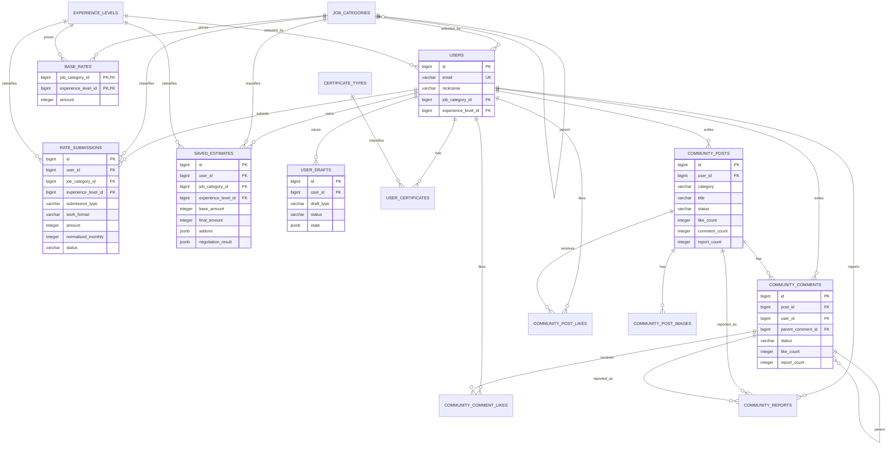
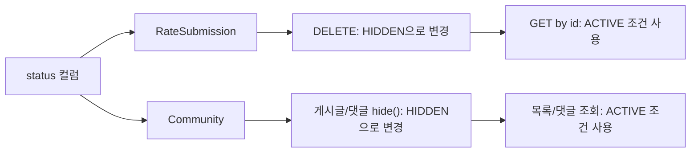

# 데이터 모델

이 문서는 JPA 엔티티 기준으로 핵심 테이블 관계를 정리한다. 전체 컬럼 목록은 마이그레이션 파일과 엔티티를 기준으로 확인하고, 이 문서에서는 도메인 간 연결과 모델링 의도를 빠르게 파악하는 데 필요한 관계를 중심으로 기록한다.

기준 코드: `domain/entity/` 패키지 (2026-07 기준)

---

## 1. 핵심 ERD

---

## 2. 도메인별 테이블 그룹

| 그룹 | 주요 테이블 | 역할 |
|------|-------------|------|
| 계정/Profile | `users`, `user_certificates`, `certificate_types`, `user_drafts` | 사용자 식별, 직무/경력 선택, 보유 자격증 연결, 온보딩/견적 진행 상태 저장 |
| 기준 데이터 | `job_categories`, `experience_levels`, `regions`, `work_types` | 화면 입력과 계산에 공통으로 사용되는 마스터 데이터 |
| 단가 제보 | `rate_submissions` | 사용자가 제출한 단가 데이터와 정규화 월 단가 저장 |
| 견적 | `base_rates`, `saved_estimates` | 기준 단가와 사용자별 저장 견적 관리 |
| 커뮤니티 | `community_posts`, `community_comments`, `community_*_likes`, `community_reports`, `community_post_images` | 게시글, 댓글, 좋아요, 신고, 이미지 관리 |

---

## 3. 모델링 특이점

| 항목 | 현재 모델 | 확인 포인트 |
|------|-----------|-------------|
| 기준 단가 복합 키 | `base_rates`는 `job_category_id` + `experience_level_id`를 복합 PK로 사용한다. | 특정 직무/경력 조합의 기준 단가가 하나만 존재하도록 제한한다. |
| 직무 카테고리 계층 | `job_categories.parent_id`가 같은 테이블을 참조한다. | depth/displayOrder와 함께 계층형 직무 탐색에 사용된다. |
| 커뮤니티 작성자 스냅샷 | 게시글/댓글은 작성 당시 직무/경력 정보를 별도 컬럼으로 보관한다. | 사용자가 이후 프로필을 바꿔도 기존 게시글의 작성자 맥락은 유지된다. |
| JSONB 사용 | `saved_estimates.addons`, `negotiation_result` 등 일부 상태는 JSONB로 저장된다. | 스키마가 유연한 대신 DB 레벨 제약과 검색성은 낮아진다. |
| 사용자 드래프트 | `user_drafts`는 `user_id` + `draft_type` unique constraint를 둔다. | 사용자별로 온보딩/견적 타입마다 하나의 진행 상태만 유지한다. |
| 소프트 삭제 | `rate_submissions`, `community_posts`, `community_comments`는 status 기반 숨김 처리를 사용한다. | 조회 API는 ACTIVE 상태를 기준으로 응답한다. |
| 좋아요 중복 방지 | `community_post_likes`, `community_comment_likes`는 사용자/대상 조합에 unique constraint를 둔다. | 같은 사용자의 중복 좋아요를 DB 제약으로도 막는다. |

---

## 4. 상태 기반 조회 차이

같은 `status` 기반 소프트 삭제 패턴을 사용하며, 조회 시점에는 `ACTIVE` 조건을 강제한다. 단가 제보의 소유권/숨김 정책은 [단가 제출 API 가이드](../api/rate-submission)에서 관리한다.

---

## 관련 문서

- [아키텍처 개요](./architecture-overview)
- [도메인 핵심 지식 가이드](./domain-knowledge-guide)
- [단가 제출 API 가이드](../api/rate-submission)
