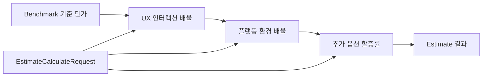
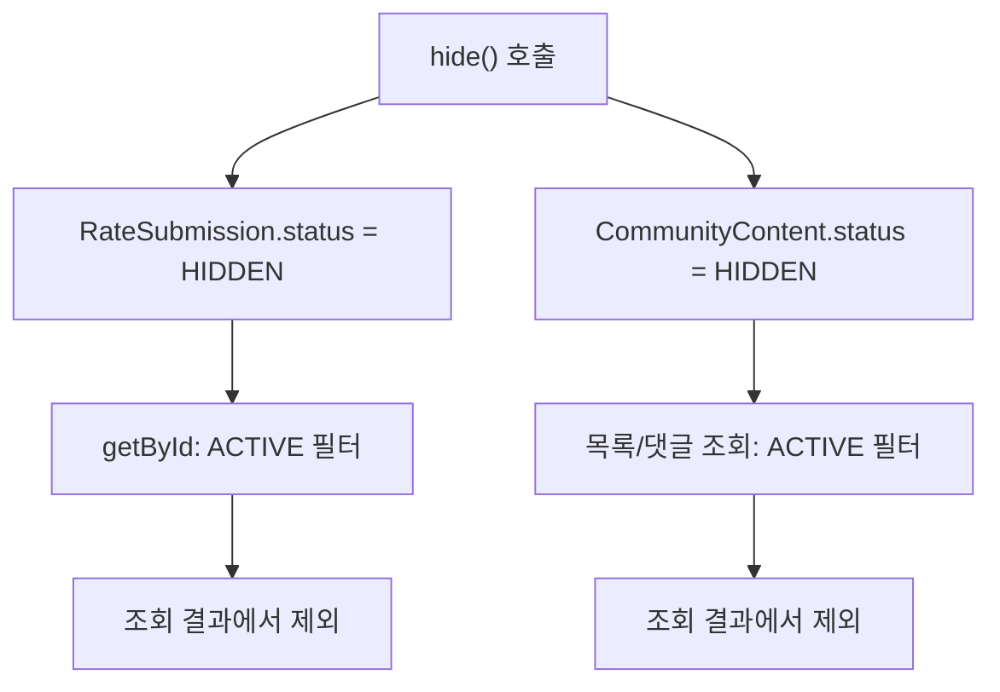

# 도메인 핵심 지식 가이드 (Domain Knowledge Guide)

> 💡 **본 문서의 목적**
> 시스템 내의 엔티티나 Enum 값 중, 이름만으로는 비즈니스적 본질을 파악하기 어렵거나 코드 내부에 중요한 계산 로직(배율, 수식)이 가려져 있는 **핵심 도메인 지식**을 집중 관리한다.
> 이름 자체로 의미가 명확한 자기설명적 데이터는 본 가이드에서 제외하여 문서 파편화를 방지한다.

기준 코드: `domain/enums/`, `EstimateService.java`, `CommunityService.java` (2026-07 기준)

---

## 1. 단가 제출(RateSubmission) 도메인

### 1.1 SubmissionType (`TRACK_A` / `TRACK_B`)

### 1.2 SubmissionStatus (`ACTIVE` / `FLAGGED` / `HIDDEN`)

- **ACTIVE / HIDDEN**: 제보의 활성 상태와 소프트 삭제(숨김)를 표현하며 실제 서비스 로직(`RateSubmissionService.delete()` → `hide()`)에서 사용된다.
- **FLAGGED (확장 예정 후보)**: enum에는 선언되어 있으나, 코드베이스 전체에서 이 값을 세팅하거나 조건절에서 조회하는 곳이 없다. 신고/모니터링 기능과 연결할 수 있는 값이지만, 현재 구현 기준으로는 미사용 상태다.

---

## 2. 견적(Estimate) 도메인 — enum에 숨겨진 가격 배율

Swagger UI 스키마에는 아래 enum들이 단순 문자열(이름)로만 노출되지만, 실제로는 `EstimateService.doCalculate()`의 견적 계산식에 곱해지는 배율/할증률이 값으로 붙어 있다.

```java
BigDecimal uxMultiplier = request.getUxEngagement().getMultiplier();
BigDecimal platformMultiplier = request.getPlatformEnvironment().getMultiplier();
int addonPercent = addons.stream().mapToInt(EstimateAddon::getPercent).sum();
```



### 2.1 UX 인터랙션 수준 (`UxEngagement`)

| Enum 값 | 배율 |
| :--- | :--- |
| `GUI_ONLY` | 1.0 |
| `WIREFRAME_PLUS` | 1.3 |
| `FULL_PLANNING` | 1.8 |

### 2.2 플랫폼 환경 (`PlatformEnvironment`)

| Enum 값 | 배율 |
| :--- | :--- |
| `MOBILE_APP` | 1.0 |
| `PC_WEB` | 1.0 |
| `RESPONSIVE_WEB` | 1.5 |

### 2.3 견적 추가 옵션 (`EstimateAddon`)

| Enum 값 | 할증률 |
| :--- | :--- |
| `DESIGN_SYSTEM` | +20% |
| `PROTOTYPING` | +10% |
| `SOURCE_TRANSFER` | +20% |

---

## 3. 커뮤니티(Community) 도메인

### 3.1 CommunityContentStatus (`ACTIVE` / `HIDDEN`)

`CommunityPost`/`CommunityComment`도 `RateSubmission`과 같은 이름의 소프트 삭제 패턴(`status` 필드 + `hide()`)을 쓴다. 조회 시에는 두 도메인 모두 ACTIVE 상태를 기준으로 필터링한다.



커뮤니티 도메인은 엔드포인트 수가 많으므로, 추후 별도 Community API 문서로 CRUD, 좋아요, 신고, 내 활동 조회 흐름을 분리해 정리할 예정이다.

---

## 4. 참고 — 가이드에서 제외한 자기설명적 enum

아래 값들은 이름 자체로 의미가 명확해 별도 설명을 생략한다. 상세 스펙은 Swagger를 참고한다.

- `WorkFormat` (`ON_SITE`, `REMOTE`, `HYBRID`)
- `AmountUnit` (`MONTHLY`, `TOTAL`)
- `CommunityCategory` (`QNA`, `INFO`, `FREE`)
- `CommunityPostSort` (`LATEST`, `LIKES`, `COMMENTS`)
- `CommunityReportReason` (`ABUSE`, `FALSE_INFO`, `SPAM`, `ETC`)

---

## 관련 문서

- [프로젝트 개요](/)
- [아키텍처 개요](./architecture-overview) — 소프트 삭제 정책의 도메인 간 차이
- [단가 제출 API 가이드](../api/rate-submission)
