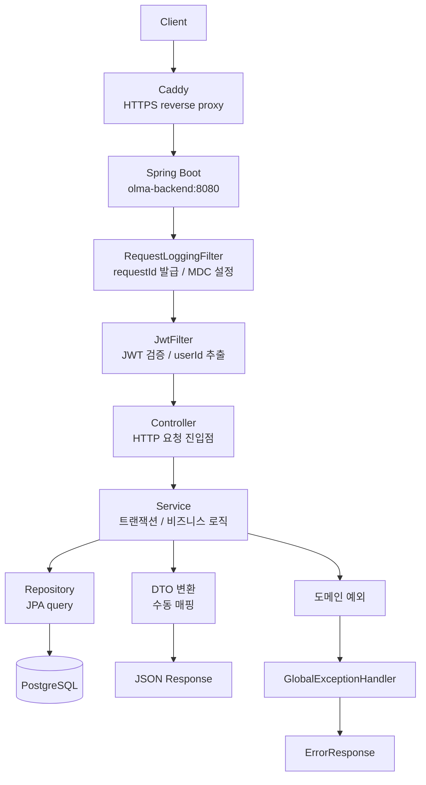
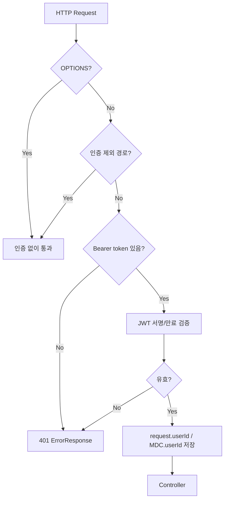
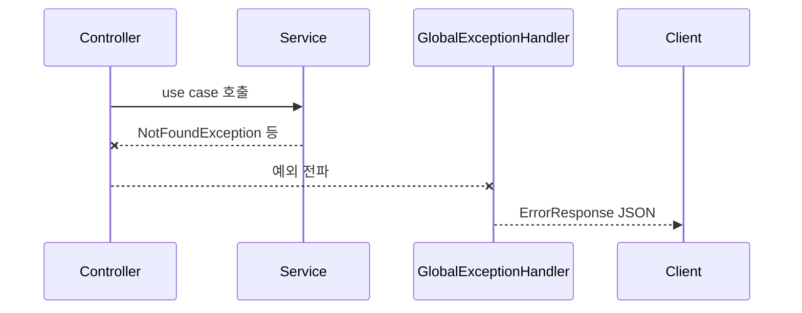
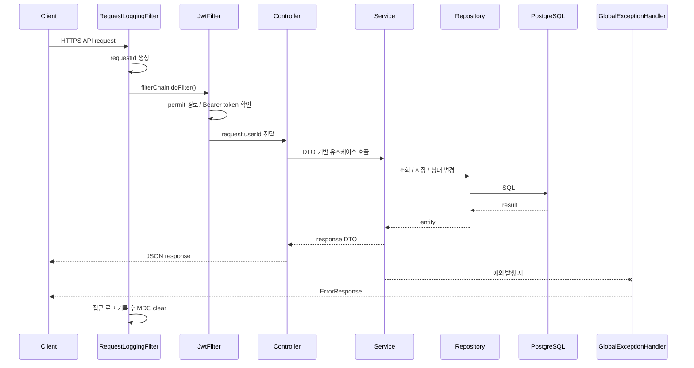

# 요청 처리 흐름

이 문서는 인증이 필요한 일반 API 요청이 백엔드 내부에서 어떤 순서로 처리되는지 정리한다. 세부 구현 설명은 [아키텍처 개요](./architecture-overview)를 참고하고, 이 문서는 요청 단위의 실행 경로를 빠르게 파악하는 데 집중한다.

기준 코드: `RequestLoggingFilter`, `JwtFilter`, `*Controller`, `*Service`, `*Repository`, `GlobalExceptionHandler`

## 전체 흐름



## 1. Caddy에서 애플리케이션까지

운영 환경에서 외부 요청은 Caddy가 먼저 받는다.

| 공개 도메인 | 내부 대상 |
| --- | --- |
| `https://api.olma.kro.kr` | `localhost:8080` |
| `https://grafana.olma.kro.kr` | `localhost:3000` |

백엔드 컨테이너는 `127.0.0.1:8080:8080`으로 바인딩되어 있어, 외부에서 8080 포트로 직접 접근하는 구조가 아니다. 운영 구성은 [배포 아키텍처](../ops/deploy)에 기록한다.

## 2. RequestLoggingFilter

`RequestLoggingFilter`는 필터 체인에서 먼저 실행된다.

| 단계 | 처리 |
| --- | --- |
| 요청 시작 | `requestId` 생성 |
| MDC 설정 | `requestId` 저장 |
| 다음 필터 호출 | `filterChain.doFilter()` |
| 응답 완료 | method, path, status, durationMs, userId 로그 기록 |
| 정리 | `MDC.clear()` |

상태 코드별 로그 레벨:

| 상태 | 로그 레벨 |
| --- | --- |
| `2xx`, `3xx` | info |
| `4xx` | warn |
| `5xx` | error |

## 3. JwtFilter

`JwtFilter`는 인증 제외 경로와 `OPTIONS` 요청을 먼저 확인한다.



인증 제외 경로:

| 경로 | 용도 |
| --- | --- |
| `/v1/auth/` | 회원가입, 로그인 |
| `/swagger-ui` | Swagger UI |
| `/v3/api-docs` | OpenAPI JSON |
| `/actuator` | Health, Prometheus |

Spring Security Starter를 사용하지 않으므로, 컨트롤러는 `SecurityContextHolder`가 아니라 `HttpServletRequest` attribute에서 사용자 ID를 직접 꺼낸다.

```java
Long userId = (Long) httpRequest.getAttribute("userId");
```

## 4. Controller

컨트롤러는 HTTP 요청과 응답의 경계를 담당한다.

| 책임 | 설명 |
| --- | --- |
| 요청 바인딩 | `@RequestBody`, `@PathVariable`, `@RequestParam` |
| Bean Validation | `@Valid`, DTO validation annotation |
| 인증 사용자 추출 | `HttpServletRequest`의 `userId` |
| 서비스 호출 | 비즈니스 로직은 Service에 위임 |
| 응답 상태 | `@ResponseStatus`, 반환 DTO |

`@SecurityRequirement`는 Swagger UI 표시용이다. 실제 인증 여부는 `JwtFilter`가 결정한다.

## 5. Service

Service는 트랜잭션 경계와 비즈니스 규칙을 담당한다.

| 처리 | 예시 |
| --- | --- |
| 참조 데이터 검증 | 존재하지 않는 `jobCategoryId`, `experienceLevelId` 거부 |
| 소유권 확인 | 견적/커뮤니티 수정/삭제 시 `userId` 비교 |
| 도메인 계산 | 단가 정규화, 견적 계산, 벤치마크 |
| 상태 변경 | 소프트 삭제 시 `status = HIDDEN` |
| 응답 변환 | Entity를 Response DTO로 수동 변환 |

## 6. Repository와 Entity

Repository는 Spring Data JPA를 사용한다. 복잡한 통계성 쿼리는 repository query method 또는 JPQL/native query로 처리한다.

Entity는 일부 도메인 상태 변경 메서드를 갖는다.

| Entity | 상태 변경 예 |
| --- | --- |
| `RateSubmission` | `hide()`로 `SubmissionStatus.HIDDEN` 처리 |
| `CommunityPost` | `hide()`로 `CommunityContentStatus.HIDDEN` 처리 |
| `CommunityComment` | `hide()`로 `CommunityContentStatus.HIDDEN` 처리 |

## 7. 예외 처리

서비스나 컨트롤러에서 발생한 예외는 `GlobalExceptionHandler`가 공통 `ErrorResponse`로 변환한다.



대표 매핑:

| 예외 | 상태 |
| --- | --- |
| `MethodArgumentNotValidException` | 400 |
| `IllegalArgumentException` | 400 |
| `InvalidCredentialsException` | 401 |
| `ForbiddenException` | 403 |
| `NotFoundException` | 404 |
| `DuplicateValueException` | 409 |
| 그 외 예외 | 500 |

## 8. 대표 시퀀스



## 관련 문서

- [아키텍처 개요](./architecture-overview)
- [API 공통 규격](../api/common)
- [로깅/모니터링](../observability/logging)
- [배포 아키텍처](../ops/deploy)
