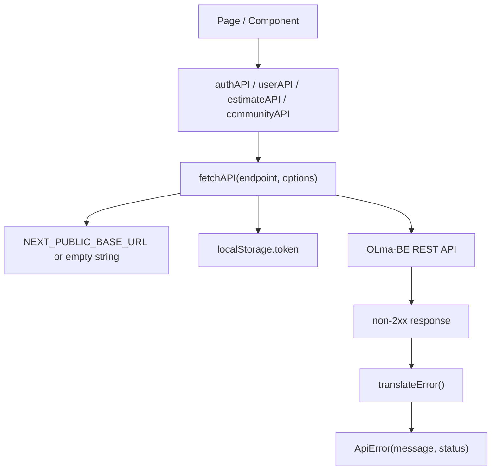
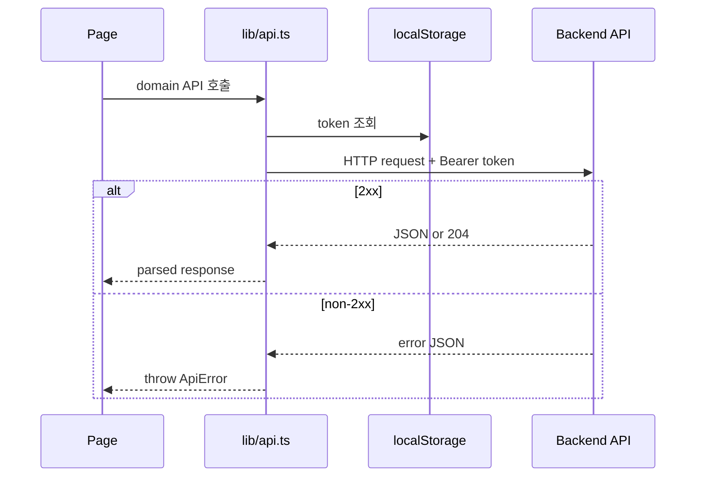

# API 연동

프론트엔드의 백엔드 API 호출은 `lib/api.ts`에 집중되어 있다. 화면 컴포넌트는 `authAPI`, `userAPI`, `estimateAPI` 같은 도메인별 객체를 호출하고, 공통 `fetchAPI()`가 실제 HTTP 요청을 수행한다.

## API client 구조



## Base URL 결정

`lib/api.ts`는 다음 값을 기준으로 요청 URL을 만든다.

```ts
const BASE_URL = process.env.NEXT_PUBLIC_BASE_URL ?? "";
```

| 상황 | 동작 |
| --- | --- |
| `NEXT_PUBLIC_BASE_URL` 있음 | 해당 origin으로 API 요청 |
| `NEXT_PUBLIC_BASE_URL` 없음 | 현재 프론트 origin 기준 상대 경로 요청 |

`next.config.ts`에는 `/api/:path*` rewrite가 정의되어 있지만, 현재 `lib/api.ts`의 endpoint는 `/v1/...` 형태를 직접 사용한다. 따라서 `/api` rewrite는 현재 API client 호출 흐름과 직접 연결되어 있지 않다.

```ts
// next.config.ts
destination: "http://13.124.31.106/:path*"
```

이 값은 현재 EC2 IP에 하드코딩되어 있으므로, 포트폴리오 보존 기준으로는 운영 당시 API origin을 문서화된 설정값이나 환경 변수 기반 설정으로 분리하는 것이 좋다.

## 인증 헤더

`fetchAPI()`는 브라우저 환경에서 `localStorage.token`을 읽어 `Authorization` 헤더를 추가한다.

| 항목 | 현재 구현 |
| --- | --- |
| 저장 위치 | `localStorage.token` |
| 헤더 | `Authorization: Bearer <token>` |
| 쿠키 사용 | `credentials: "omit"` |
| 인증 실패 처리 | 각 화면의 catch 또는 페이지별 redirect 로직 |



## 도메인별 API 모듈

| 객체 | 주요 엔드포인트 | 사용 화면 |
| --- | --- | --- |
| `authAPI` | `/v1/auth/signup`, `/v1/auth/login`, `/v1/auth/logout` | 로그인, 회원가입, Topbar |
| `userAPI` | `/v1/users/{id}`, `/v1/users/{id}/profile`, `/v1/users/me/password`, `/v1/users/me` | 설정, 대시보드, 커리어, 온보딩 |
| `userDraftAPI` | `/v1/users/me/drafts`, `/v1/users/me/drafts/{type}` | 온보딩, 견적 진행 상태 복원 |
| `referenceAPI` | `/v1/reference/job-categories`, `/v1/reference/experience-levels` | 대시보드, 커뮤니티 필터 |
| `submissionAPI` | `/v1/submissions` | 온보딩 |
| `submissionDeleteAPI` | `/v1/submissions/{id}` | 커리어 |
| `careerSaveAPI` | `/v1/submissions`, `/v1/submissions/{id}`, `/v1/submissions/{id}/project-name` | 대시보드, 커리어 |
| `estimateAPI` | `/v1/estimates`, `/v1/estimates/calculate`, `/v1/estimates/negotiation/simulate` 등 | 견적, 커리어 |
| `communityAPI` | `/v1/community/posts`, comments, likes, reports, my posts/comments | 커뮤니티, 내 활동 |
| `benchmarkAPI` | `/v1/benchmark` | 대시보드 |

## 브라우저 저장 값

API 연동과 관련해 FE가 브라우저에 저장하는 값은 다음과 같다.

| key | 용도 | 주의 |
| --- | --- | --- |
| `token` | JWT 인증 헤더 | XSS에 노출될 수 있으므로 외부 스크립트와 입력 처리 주의 |
| `userId` | 사용자 프로필/제출 이력 조회 | 서버 권한 판단의 근거로 신뢰하면 안 됨 |
| `nickname` | 화면 표시 | 서버 최신 프로필과 불일치 가능 |
| `careerSavedIds` | 커리어 저장 항목 보조 추적 | 브라우저/기기 간 동기화되지 않음 |
| `sessionStorage.olma_estimate_draft` | 견적 입력 임시 상태 | 브라우저 세션 종료 시 사라짐 |

## 에러 메시지 변환

백엔드 에러 메시지 일부는 프론트에서 사용자 친화적인 한국어 문구로 변환한다.

| 백엔드 메시지 | 프론트 메시지 |
| --- | --- |
| `nickname already in use` | 이미 사용 중인 닉네임이에요. |
| `email already in use` | 이미 사용 중인 이메일이에요. |
| `invalid credentials` | 이메일 또는 비밀번호가 올바르지 않아요. |
| `user not found` | 존재하지 않는 계정이에요. |

그 외 메시지는 백엔드 응답의 `message`를 그대로 사용한다.

## API 변경 체크리스트

백엔드 API 요청/응답이 바뀌면 프론트엔드 구현과 문서를 함께 확인한다.

| 확인 항목 | 위치 |
| --- | --- |
| Controller 경로/메서드 | BE `controller/*Controller.java` |
| Request/Response DTO | BE `dto/*Request`, `dto/*Response` |
| OpenAPI 설명 | BE `@Operation`, `@ApiResponse`, `@Schema` |
| FE API client | FE `lib/api.ts` |
| FE 화면 타입 | FE `app/`, `components/`의 interface/type |
| Docusaurus 문서 | API 문서와 프론트엔드 API 연동 문서 |

## 현재 한계

| 항목 | 현재 상태 | 개선 방향 |
| --- | --- | --- |
| API origin | `NEXT_PUBLIC_BASE_URL`가 없으면 상대 경로, `next.config.ts`는 IP rewrite | 운영 당시 API origin을 환경 변수 기준으로 명확화 |
| 타입 관리 | API request/response 타입을 수동 선언 | OpenAPI JSON 기반 타입 생성 검토 |
| 삭제 API | 일부 API가 공통 `fetchAPI()` 대신 직접 `fetch()` 사용 | 공통 에러 처리와 인증 헤더 로직 재사용 |
| 401 처리 | 페이지별 redirect/catch에 분산 | 공통 인증 만료 처리 도입 |
| 에러 스키마 | `err.message` 존재를 가정 | 공통 에러 응답 구조와 방어 코드 정리 |
