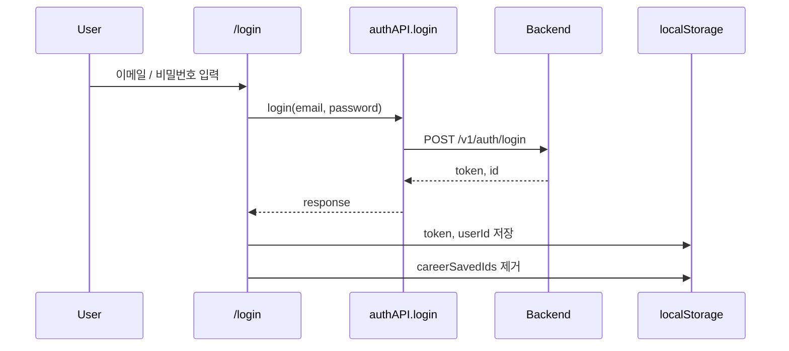
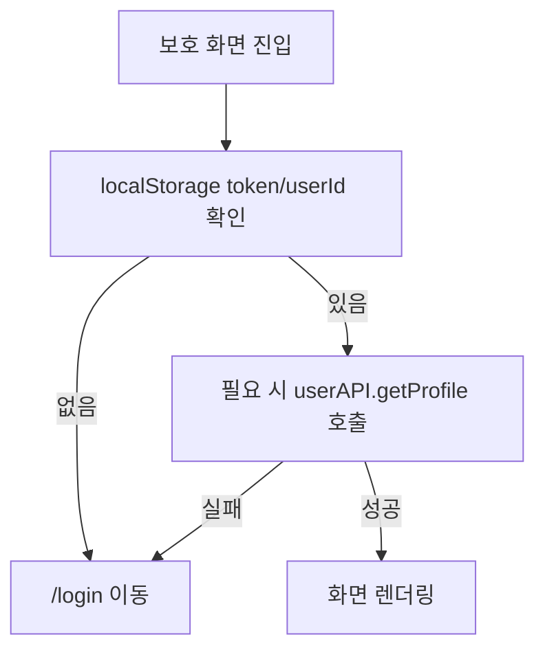

# 인증 흐름

OLma 프론트엔드는 JWT를 `localStorage`에 저장하고, API 요청 시 `Authorization: Bearer <token>` 헤더로 전달한다. 쿠키 기반 세션은 사용하지 않는다.

## 저장 값

| key | 저장 시점 | 용도 |
| --- | --- | --- |
| `token` | 로그인/회원가입 성공 | API 인증 헤더 |
| `userId` | 로그인/회원가입 성공 | 사용자 프로필, 제출 이력 조회 |
| `nickname` | 회원가입 성공 | 온보딩 로딩 문구 등 화면 표시 |
| `careerSavedIds` | 온보딩/대시보드 저장 후 | 커리어 화면에서 저장된 단가 기록 추적 |
| `sessionStorage.olma_estimate_draft` | 견적 화면 입력 중 | 온보딩 등 다른 화면을 거친 뒤 견적 입력 상태 복원 |

## 로그인

로그인 실패 시 `lib/api.ts`의 `translateError()`를 거쳐 사용자 메시지를 표시한다.

## 회원가입

회원가입 화면은 이메일, 비밀번호, 닉네임을 클라이언트에서 먼저 검증한다.

| 항목 | 검증 |
| --- | --- |
| 이메일 | 기본 이메일 형식 |
| 비밀번호 | 8자 이상, 영문/숫자/특수문자 포함 |
| 비밀번호 확인 | 비밀번호와 일치 |
| 닉네임 | 2~10자, 한글/영문/숫자/`-_.` 허용 |

회원가입 성공 후에는 `token`, `userId`, `nickname`을 저장하고 온보딩으로 이동한다.

## 로그아웃

`components/topbar.tsx`에서 로그아웃 시 브라우저 저장 값을 제거하고 홈으로 이동한다.

| 제거 값 |
| --- |
| `token` |
| `userId` |
| `careerSavedIds` |

백엔드 `POST /v1/auth/logout` API도 `authAPI.logout()`에 정의되어 있으나, 실제 화면 흐름에서는 브라우저 저장 값 제거가 핵심 동작이다.

## 보호 화면 접근

현재는 Next.js middleware나 서버 컴포넌트 기반 인증 검사를 사용하지 않는다. 각 클라이언트 페이지가 `localStorage`를 확인해 인증 필요 여부를 판단한다.

## 인증 흐름의 현재 한계

| 항목 | 현재 상태 | 개선 방향 |
| --- | --- | --- |
| 토큰 저장 | `localStorage` | XSS 방어 정책과 토큰 저장 전략 재검토 |
| 보호 라우트 | 페이지별 검사 | middleware 또는 공통 guard 도입 검토 |
| 인증 만료 | API catch/redirect 분산 | 401 공통 처리 |
| 사용자 상태 | Topbar와 각 페이지에서 개별 조회 | 사용자 session context 또는 query cache 검토 |
| 견적 draft | `sessionStorage` | 브라우저 세션 종료 시 복원 불가 |
| 로그아웃 | localStorage 제거 중심 | 백엔드 logout API 호출 여부와 실패 처리 명확화 |
