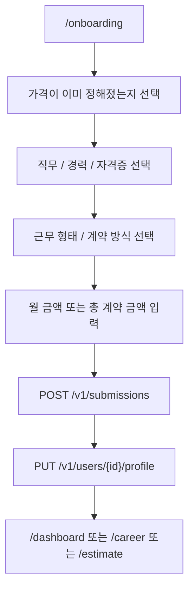
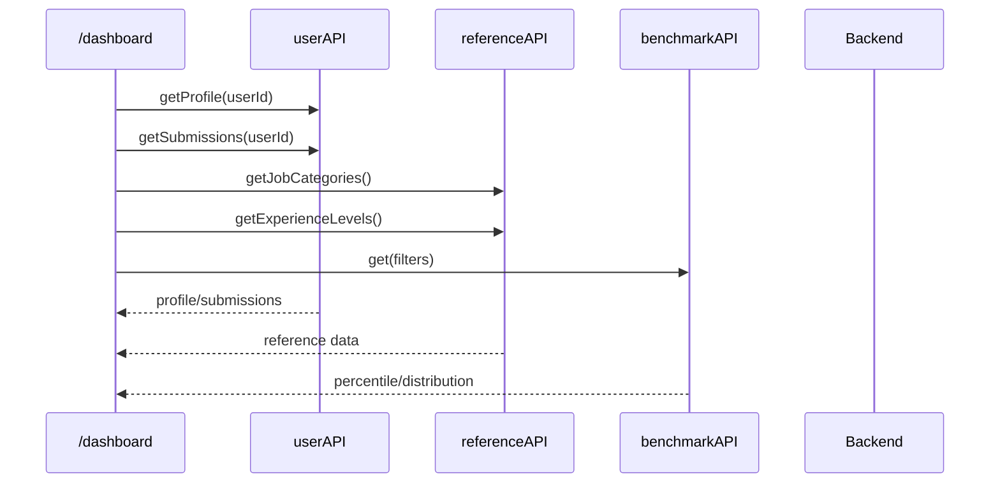
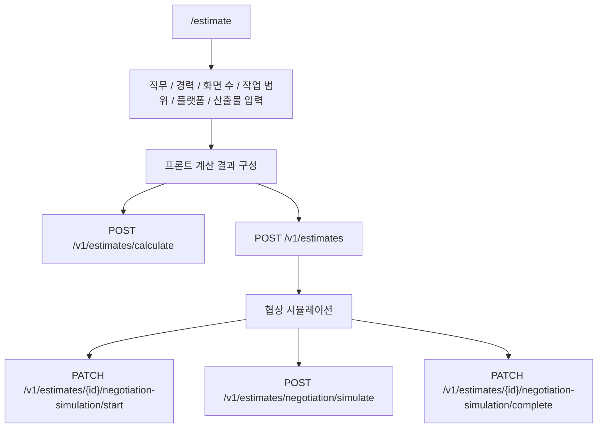
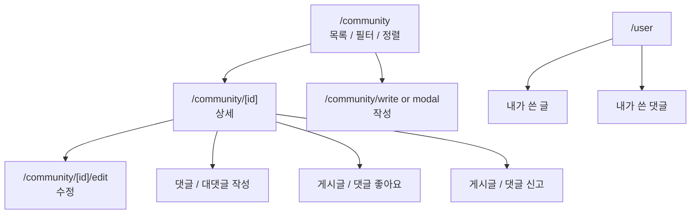

# 주요 도메인 흐름

이 문서는 프론트엔드 화면에서 관찰되는 주요 사용자 흐름과 백엔드 API 연동을 정리한다.

## 온보딩

온보딩 질문은 `lib/onboarding/steps.ts`에서 정의하고, 화면 라벨을 백엔드 코드 값으로 바꾸는 매핑은 `lib/onboarding/maps.ts`에서 관리한다.

주요 매핑:

| UI 라벨 | 백엔드 값 |
| --- | --- |
| 웹 UI/UX | `jobCategoryId: 14` |
| 앱 UI/UX | `jobCategoryId: 28` |
| 100% 상주 | `ON_SITE` |
| 100% 원격 | `REMOTE` |
| 상주+원격 혼합 | `HYBRID` |
| 월 단위 계약 | `MONTHLY` |
| 건별 외주 계약 | `TOTAL` |

## 대시보드

대시보드는 사용자 프로필, 제출 이력, 기준 데이터, 벤치마크 데이터를 조합해 사용자의 단가 위치를 보여준다.

대시보드는 `careerSavedIds`를 사용해 사용자가 저장한 단가 기록이 서버에 남아 있는지 확인하고, 사라진 ID는 클라이언트 저장소에서 제거한다.

## 견적 계산

견적 화면은 `lib/estimate/constants.ts`와 `lib/estimate/utils.ts`의 라벨/enum/계산 보조 로직을 사용한다.

견적 도메인은 UI 라벨과 백엔드 enum 간 변환이 많으므로, 프론트/백엔드 중 한쪽에서 enum 이름이 변경되면 함께 확인해야 한다.

| UI 항목 | 백엔드 값 |
| --- | --- |
| 기획서 100% 완료 | `GUI_ONLY` |
| 와이어프레임 기반 UX 고도화 + GUI | `WIREFRAME_PLUS` |
| 초기 아이디어부터 UX/UI 전체 기획 | `FULL_PLANNING` |
| 모바일 앱 | `MOBILE_APP` |
| 일반 PC 웹 | `PC_WEB` |
| 반응형 웹 | `RESPONSIVE_WEB` |
| 디자인 시스템 | `DESIGN_SYSTEM` |
| 프로토타이핑 | `PROTOTYPING` |
| 원본 소스 전송 | `SOURCE_TRANSFER` |

## 커리어

커리어 화면은 단가 기록과 견적서 보관함을 함께 제공한다.

| 탭 | 주요 API |
| --- | --- |
| 단가 기록 | `GET /v1/submissions/{id}`, `DELETE /v1/submissions/{id}`, `PATCH /v1/submissions/{id}/project-name` |
| 견적서 보관함 | `GET /v1/estimates`, `DELETE /v1/estimates/{id}`, `GET /v1/estimates/{id}` |

현재 단가 기록 목록은 `careerSavedIds`에 저장된 ID를 기준으로 개별 조회한다. 따라서 다른 브라우저나 기기에서 저장한 기록과의 동기화 정책은 별도 검토 대상이다.

## 커뮤니티

커뮤니티는 목록, 상세, 작성, 수정, 댓글, 좋아요, 신고, 내 활동 조회를 포함한다.

주요 API:

| 기능 | API |
| --- | --- |
| 목록 | `GET /v1/community/posts` |
| 상세 | `GET /v1/community/posts/{postId}` |
| 작성 | `POST /v1/community/posts` |
| 수정 | `PUT /v1/community/posts/{postId}` |
| 삭제 | `DELETE /v1/community/posts/{postId}` |
| 게시글 좋아요 | `POST/DELETE /v1/community/posts/{postId}/likes` |
| 게시글 신고 | `POST /v1/community/posts/{postId}/reports` |
| 댓글 작성 | `POST /v1/community/posts/{postId}/comments` |
| 댓글 수정/삭제 | `PUT/DELETE /v1/community/comments/{commentId}` |
| 댓글 좋아요 | `POST/DELETE /v1/community/comments/{commentId}/likes` |
| 댓글 신고 | `POST /v1/community/comments/{commentId}/reports` |
| 내 글/댓글 | `GET /v1/community/me/posts`, `GET /v1/community/me/comments` |

## 관련 백엔드 문서

- [API 공통 규격](../api/common)
- [단가 제출 API](../api/rate-submission)
- [도메인 핵심 지식 가이드](../development/domain-knowledge-guide)
