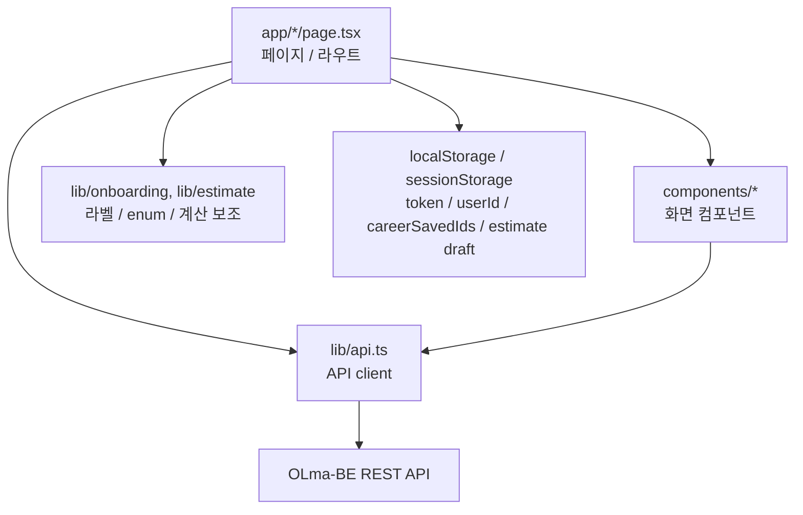

# 프론트엔드 개요

이 문서는 OLma 프론트엔드 저장소의 현재 구현 상태를 기준으로 작성한다.

기준 저장소: `Olma-Web/OLma-FE`  
기준 브랜치: `main`  
기준 커밋: `3102514`  
주요 기준 파일: `package.json`, `next.config.ts`, `app/`, `components/`, `lib/`

## 역할

OLma 프론트엔드는 사용자가 자신의 디자인 단가를 입력하고, 시장 데이터와 비교하며, 견적과 커뮤니티 기능을 사용할 수 있는 웹 클라이언트다.

프론트엔드는 다음 책임을 가진다.

| 영역 | 책임 |
| --- | --- |
| 화면 구성 | 랜딩, 로그인/회원가입, 온보딩, 대시보드, 커리어, 견적, 커뮤니티, 설정 화면 제공 |
| 사용자 입력 | 온보딩 답변, 견적 조건, 커뮤니티 글/댓글, 계정 설정 입력 수집 |
| API 연동 | 백엔드 REST API 호출, JWT 인증 헤더 추가, 에러 메시지 변환 |
| 클라이언트 상태 | `localStorage` 기반 토큰, 사용자 ID, 임시 저장 ID 관리 |
| 도메인 매핑 | UI 라벨을 백엔드 enum/code 값으로 변환 |

## 기술 스택

| 구분 | 사용 기술 |
| --- | --- |
| Framework | Next.js 16 App Router |
| UI Runtime | React 19 |
| Language | TypeScript |
| Styling | Tailwind CSS 4 |
| Icons | lucide-react |
| Capture | html2canvas-pro |
| Validation | ESLint, eslint-config-next |
| E2E 준비 | Playwright dependency 및 `playwright.check.js` |

## 디렉터리 구조

현재 프론트엔드는 `src/` 디렉터리를 사용하지 않고, Next.js App Router의 기본 루트 구조를 사용한다. 스타일은 Tailwind CSS 4의 CSS-first 구성을 사용하며, 별도 `tailwind.config` 파일보다는 `app/globals.css`와 PostCSS 설정을 중심으로 관리한다.

```text
OLma-FE/
├── app/                # App Router 라우트와 페이지
├── components/         # 공통 UI 및 도메인 컴포넌트
│   ├── community/      # 커뮤니티 글쓰기 폼/모달
│   ├── estimate/       # 견적 계산/협상 관련 UI
│   └── ui/             # 입력 컴포넌트, 사용자 드롭다운 등
├── lib/
│   ├── api.ts          # 백엔드 API client
│   ├── onboarding/     # 온보딩 질문/라벨 매핑
│   └── estimate/       # 견적 계산 상수/변환 유틸
├── public/             # 이미지, 아이콘, 배경 리소스
├── next.config.ts      # Next.js 설정 및 API rewrite
└── package.json        # script와 dependency 정의
```

## 레이어 경계



프론트엔드는 백엔드 API의 영속 상태를 직접 관리하지 않는다. 서버 상태는 REST API를 통해 조회/변경하고, 브라우저에는 인증 토큰과 일부 화면 보조 상태만 저장한다.

## 주요 화면

| 화면 | 경로 | 역할 |
| --- | --- | --- |
| 랜딩 | `/` | 서비스 진입, 온보딩 시작 유도 |
| 로그인 | `/login` | 인증 토큰 발급 |
| 회원가입 | `/signup` | 계정 생성 및 온보딩 진입 |
| 온보딩 | `/onboarding` | 단가/프로필 정보 수집 |
| 대시보드 | `/dashboard` | 시장 벤치마크와 사용자 단가 비교 |
| 커리어 | `/career` | 단가 기록과 견적서 보관함 관리 |
| 견적 | `/estimate` | 스마트 견적 계산 및 협상 시뮬레이션 |
| 커뮤니티 | `/community` | 게시글 목록, 상세, 작성, 수정 |
| 내 활동 | `/user` | 내가 쓴 글/댓글 조회 |
| 설정 | `/settings` | 계정 정보, 비밀번호, 탈퇴 |

## 관련 문서

- [프론트엔드 라우팅](./routing)
- [API 연동](./api-integration)
- [인증 흐름](./auth-flow)
- [주요 도메인 흐름](./domain-flows)
