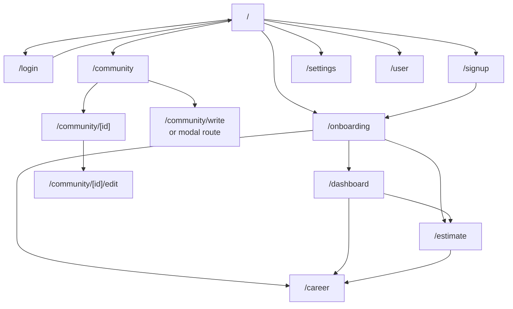

# 라우팅 구조

OLma 프론트엔드는 Next.js App Router를 사용한다. 각 화면은 `app/` 하위의 `page.tsx` 파일로 정의되어 있고, 커뮤니티 글쓰기에는 parallel/intercepting route가 일부 사용된다.

## 라우트 목록

| 경로 | 파일 | 성격 | 역할 |
| --- | --- | --- | --- |
| `/` | `app/page.tsx` | 공개 | 랜딩 화면, 로그인 여부에 따라 온보딩 진입 |
| `/login` | `app/login/page.tsx` | 공개 | 이메일/비밀번호 로그인 |
| `/signup` | `app/signup/page.tsx` | 공개 | 회원가입, 가입 후 온보딩 이동 |
| `/onboarding` | `app/onboarding/page.tsx` | 인증 필요 | 단가 정보와 프로필 정보 수집 |
| `/dashboard` | `app/dashboard/page.tsx` | 인증 필요 | 사용자 단가와 시장 벤치마크 비교 |
| `/career` | `app/career/page.tsx` | 인증 필요 | 단가 기록, 저장된 견적 관리 |
| `/estimate` | `app/estimate/page.tsx` | 인증 필요 | 견적 계산, 저장, 협상 시뮬레이션 |
| `/community` | `app/community/page.tsx` | 인증 필요 | 게시글 목록, 필터, 정렬 |
| `/community/write` | `app/community/write/page.tsx` | 인증 필요 | 게시글 작성 독립 페이지 |
| `/community/(.)write` | `app/community/@modal/(.)write/page.tsx` | 인증 필요 | 게시글 작성 intercepting modal |
| `/community/[id]` | `app/community/[id]/page.tsx` | 인증 필요 | 게시글 상세, 댓글, 좋아요, 신고 |
| `/community/[id]/edit` | `app/community/[id]/edit/page.tsx` | 인증 필요 | 게시글 수정 |
| `/user` | `app/user/page.tsx` | 인증 필요 | 내가 쓴 글/댓글 목록 |
| `/settings` | `app/settings/page.tsx` | 인증 필요 | 비밀번호 변경, 회원 탈퇴 등 계정 설정 |

## 화면 전환 흐름

## 인증이 필요한 화면의 처리 방식

프론트엔드에는 전역 middleware 기반 보호 라우트가 없다. 각 페이지나 공통 컴포넌트에서 `localStorage`의 `token`, `userId`를 확인하고, 없거나 잘못된 경우 `/login`으로 이동한다.

대표 패턴:

| 파일 | 처리 |
| --- | --- |
| `app/page.tsx` | 토큰이 없으면 온보딩 진입 대신 토스트 표시 |
| `components/topbar.tsx` | `token`, `userId` 기반 로그인 상태와 사용자 프로필 조회 |
| `app/settings/page.tsx` | 토큰/사용자 ID가 없거나 프로필 조회 실패 시 `/login` 이동 |
| `app/user/page.tsx` | 내 활동 조회 전 인증 상태 확인 |
| `app/onboarding/page.tsx` | 제출 시 `localStorage.userId`를 요청 body에 포함 |

## 커뮤니티 modal route

커뮤니티 글쓰기는 독립 페이지와 modal route를 함께 제공한다.

| 목적 | 경로 | 설명 |
| --- | --- | --- |
| 독립 작성 화면 | `/community/write` | 직접 진입 가능한 글쓰기 페이지 |
| 목록 위 작성 모달 | `/community/(.)write` | 커뮤니티 목록 문맥을 유지한 채 모달로 작성 |
| catch-all | `/community/@modal/[...catchAll]` | modal slot의 fallback 처리 |

이 구조는 사용자가 커뮤니티 목록에서 글쓰기를 시작할 때 목록 문맥을 유지할 수 있게 한다.

## 현재 라우팅 한계

| 항목 | 현재 상태 | 개선 방향 |
| --- | --- | --- |
| 보호 라우트 | 페이지별 `localStorage` 확인 | middleware 또는 공통 route guard 패턴 검토 |
| 인증 실패 처리 | 화면마다 `router.push('/login')` 처리 | API 401 응답 처리와 인증 만료 UX 통합 |
| 공개/비공개 정책 | 코드에 분산 | 라우트 정책 표를 코드/문서와 함께 관리 |
| metadata | 기본 `Create Next App` 값 일부 존재 | 서비스명/설명/OG 이미지 정리 |
