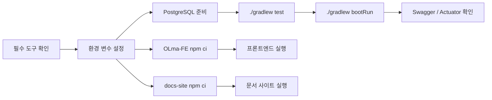

# 로컬 개발 환경

이 문서는 OLma 백엔드, 프론트엔드, 문서 사이트를 로컬에서 실행하고 검증하는 기본 절차를 정리한다.



---

## 1. 필수 도구

| 도구 | 기준 |
|------|------|
| JDK | Java 21 |
| Gradle | 프로젝트 내 `gradlew` 사용 |
| PostgreSQL | 17 권장 |
| Node.js | 20 이상 (`docs-site/package.json` 기준) |
| npm | `docs-site/package-lock.json` 기준 설치 |

---

## 2. 데이터베이스 준비

기본 설정은 로컬 PostgreSQL의 `olma` 데이터베이스를 사용한다.

```bash
createdb olma
```

애플리케이션 시작 시 Flyway가 `src/main/resources/db/migration`의 마이그레이션을 적용한다. JPA 설정은 `ddl-auto: validate`이므로, 스키마 생성은 Flyway 마이그레이션을 기준으로 한다.

---

## 3. 환경 변수

`application.yaml`은 아래 환경 변수를 참조한다.

```bash
export DB_HOST=localhost
export DB_PORT=5432
export DB_NAME=olma
export DB_USERNAME=olma
export DB_PASSWORD=olma
export JWT_SECRET=local-development-secret-key
```

프로파일을 명시하려면 다음 값을 추가한다.

```bash
export SPRING_PROFILES_ACTIVE=dev
```

---

## 4. 테스트 실행

```bash
./gradlew test
```

테스트는 CI에서도 동일한 명령으로 실행된다. CI 환경은 PostgreSQL 17 서비스 컨테이너를 함께 띄운다.

---

## 5. 백엔드 실행

```bash
./gradlew bootRun
```

기본 포트는 `8080`이다.

| 용도 | 경로 |
|------|------|
| Swagger UI | `http://localhost:8080/swagger-ui.html` |
| OpenAPI JSON | `http://localhost:8080/v3/api-docs` |
| Health | `http://localhost:8080/actuator/health` |
| Prometheus | `http://localhost:8080/actuator/prometheus` |

---

## 6. 문서 사이트 실행

## 6. 프론트엔드 실행

프론트엔드 저장소는 백엔드 저장소와 별도로 관리된다.

```bash
cd ../OLma-FE
npm ci
npm run dev
```

기본 개발 서버는 `http://localhost:3000/`에서 실행된다. 문서 사이트를 동시에 실행해야 한다면 둘 중 하나의 포트를 바꾼다.

백엔드 API origin은 `NEXT_PUBLIC_BASE_URL`로 지정할 수 있다.

```bash
export NEXT_PUBLIC_BASE_URL=http://localhost:8080
```

프론트엔드 빌드와 lint는 아래 명령으로 확인한다.

```bash
npm run build
npm run lint
```

현재 `main` 기준으로 `npm run build`는 통과하지만 `npm run lint`는 일부 오류가 남아 있다.

---

## 7. 문서 사이트 실행

```bash
cd docs-site
npm ci
npm run start
```

기본 개발 서버는 `http://localhost:3000/`에서 실행된다.

프론트엔드 개발 서버와 동시에 실행할 때는 문서 사이트 포트를 바꾼다.

```bash
npm run start -- --port 3001
```

정적 빌드는 아래 명령으로 검증한다.

```bash
npm run build
```

---

## 7. 변경 전 확인 항목

## 8. 변경 전 확인 항목

- API 동작 변경이 있으면 OpenAPI 주석과 Docusaurus API 문서를 함께 확인한다.
- 프론트엔드 화면/API 연동 변경이 있으면 [프론트엔드 API 연동](../frontend/api-integration)과 [주요 도메인 흐름](../frontend/domain-flows)을 함께 확인한다.
- DB 스키마 변경은 Flyway 마이그레이션으로 남기고, JPA 엔티티와 불일치하지 않는지 테스트로 확인한다.
- 인증이 필요한 새 API는 `JwtFilter`의 인증 제외 경로에 해당하지 않는지 확인한다.
- 운영 관련 변경은 [배포 아키텍처](../ops/deploy)와 [로깅 구현 레퍼런스](../observability/logging)에 영향이 있는지 확인한다.
