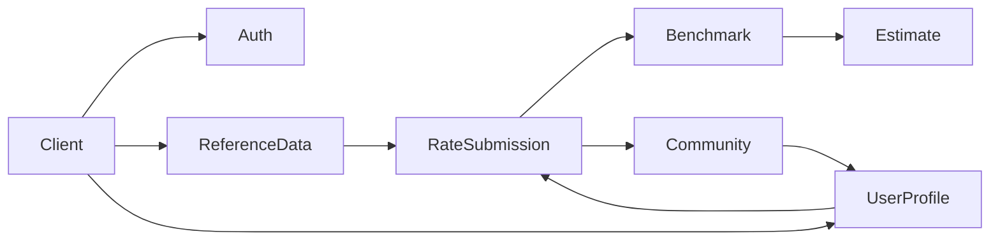

# 프로젝트 개요 (Project Overview)

> 💡 **AI 및 개발자 온보딩 가이드**
> 본 문서는 프로젝트의 전체 맥락(Context)과 비즈니스 목적을 정의합니다.
> 새로운 기능 추가 및 리팩토링 시, 본 문서에 기술된 시스템 경계와 도메인 의도를 반드시 준수해야 합니다.

---

## 1. 프로젝트 정의 & 시스템 경계 (Scope & Boundary)

### 1.1 서비스 정의
- **프로젝트명:** com.olma 백엔드 시스템
- **핵심 가치:** IT 직무별 채용 단가 정보를 투명하게 공유하고, 이를 기반으로 유저 간 신뢰성 있는 견적 산출 및 커뮤니티 소통을 지원하는 플랫폼입니다.
- **기반 기술:** Java 21 / Spring Boot 3.3.7

### 1.2 시스템 경계 (What We Do & Don't Do)
- **In-Scope (포함 영역):** 단가 제보 수집, 익명/실명 커뮤니티 운영, 단가 기반 통계/벤치마크 생성, 견적서 작성 및 관리.
- **Out-of-Scope (제외 영역):** 본 시스템은 직접적인 채용 매칭이나 결제/정산 기능을 포함하지 않습니다. (해당 기능 요구사항 발생 시 외부 아키텍처 연동 고려)

---

## 2. 비즈니스 도메인 및 API 의도 (Domain Intent)

AI Agent와 개발자가 특정 기능의 '존재 이유'를 오해하지 않도록, 컨트롤러별 핵심 비즈니스 목적과 유기적 관계를 명시합니다. 자세한 비즈니스 개념 정의는 [도메인 핵심 지식 가이드](./development/domain-knowledge-guide)를 참고하세요.

## 문서 빠른 탐색

| 찾고 싶은 정보 | 문서 |
| --- | --- |
| 로컬 실행과 검증 | [시작하기](/getting-started/local-development) |
| 화면 구조와 사용자 흐름 | [프론트엔드 개요](/frontend/overview) |
| 백엔드 레이어와 요청 흐름 | [백엔드 아키텍처](./development/architecture-overview), [요청 처리 흐름](./development/request-flow) |
| 전체 API 목록 | [도메인별 API 요약](./api/domain-summary) |
| 실제 화면 캡처 | [실제 사용 화면](./screenshots) |
| 배포와 런타임 설정 | [운영/배포](./ops/deploy), [런타임 설정](./ops/runtime-configuration) |

| 도메인 컨트롤러 | 비즈니스 목적 (Intent) 및 역할 | 관련 레퍼런스 |
| :--- | :--- | :--- |
| **AuthController** | 회원가입, 로그인, 로그아웃 처리를 담당하며 서비스 내 모든 활동의 신원 기반을 마련합니다. (Logout 시 204 No Content 반환) | - |
| **RateSubmissionController** | 핵심 데이터 소스. 유저가 실제 체감하는 채용 단가를 제보(생성/조회/수정/삭제)받고 검증하는 영역입니다. | [상세 명세](./api/rate-submission) |
| **BenchmarkController** | 제보된 단가 데이터를 가공하여 직무별/경력별 시장 표준 통계 및 지표를 제공하며, 유저 데이터와의 비교 기능을 포함합니다. | - |
| **EstimateController** | 벤치마크 데이터를 기반으로 프리랜서/외주 계약 시 활용할 수 있는 단가 견적 계산 알고리즘 및 저장된 견적서 관리를 지원합니다. | - |
| **CommunityController** | 단가 정보 및 견적에 대한 유저 간 신뢰성 검증 및 교류를 위한 게시글/댓글 CRUD, 좋아요, 신고 및 내 활동 조회 기능을 제공합니다. (가장 많은 엔드포인트 포함) | - |
| **UserProfileController** | 유저의 프로필 조회/수정, 제보 타임라인 확인, 비밀번호 변경, 회원 탈퇴 등 개인화된 계정 상태 관리를 담당합니다. | - |
| **ReferenceDataController** | 직무 카테고리, 근무 형태, 지역, 표준 경력, 자격증 등 시스템 전반에서 공통으로 사용하는 마스터 데이터 조회 전용 API입니다. | - |

> 📌 **공통 아키텍처 참고:** `GlobalExceptionHandler`는 비즈니스 API가 아니며, 시스템 전반의 예외 규격을 표준화하고 클라이언트에게 일관된 에러 응답을 보장하는 공통 인프라 레이어입니다. (상세 구현 및 예외 처리 방식은 [아키텍처 개요 문서](./development/architecture-overview) 참고)

### 2.1 도메인 관계도



---

## 3. 핵심 기술 스택 및 의존성 (Tech Stack)

AI Agent가 외부 라이브러리를 임의로 중복 추가하는 것을 방지하기 위해 표준 스택을 명시합니다.

* **Framework & Language:** Java 21, Spring Boot 3.3.7
* **Data & Persistence:** Spring Data JPA, PostgreSQL 17, Flyway (DB 마이그레이션 관리)
* **Security & Docs:** JJWT (인증), springdoc-openapi (API 자동 문서화)
* **Utilities & Test:** Validation, Actuator (모니터링), Lombok, Testcontainers (격리 테스트 환경)

---

## 4. 아키텍처 및 레이어 구조 (Architecture)

시스템의 패키지 컨벤션을 명시하여 코드 파편화를 방지합니다. 구체적인 레이어별 코딩 규칙은 [아키텍처 개요 문서](./development/architecture-overview)에 기술되어 있습니다.

```text
src/main/java/com/olma/
├── config/      # 애플리케이션 전역 설정 (Security, Swagger, DB 등)
├── controller/  # HTTP 요청 진입점 및 시스템 경계 (비즈니스 로직 포함 금지)
├── service/     # 트랜잭션 단위의 핵심 비즈니스 로직 및 유즈케이스 구현
├── domain/      # 엔티티 및 도메인 핵심 규칙 (비즈니스 상태 변경의 주체)
├── dto/         # 레이어 간 데이터 전송 객체 (Request/Response 규격)
└── exception/   # GlobalExceptionHandler 및 도메인 전용 커스텀 예외 정의
```

---

## 5. 관련 문서

- [시작하기](/getting-started/local-development) — 로컬 개발 환경, 테스트, 문서 사이트 실행
- [프론트엔드 개요](/frontend/overview) — 화면 구조, 라우팅, API 연동, 인증 흐름
- [API 레퍼런스](./api/rate-submission) — 엔드포인트 상세 명세
- [도메인별 API 요약](./api/domain-summary) — 컨트롤러 기준 전체 API 목록
- [백엔드 아키텍처](./development/architecture-overview) — 레이어 구조, 인증 필터, 전역 예외 처리
- [요청 처리 흐름](./development/request-flow) — 요청이 필터, 컨트롤러, 서비스, 레포지토리, 예외 처리로 이어지는 경로
- [데이터 모델](/development/data-model) — JPA 엔티티 기준 핵심 테이블 관계
- [운영/배포](./ops/deploy) — CI/CD, 인프라 구성
- [런타임 설정](./ops/runtime-configuration) — EC2 내부 도메인, Caddy, Docker, 환경 변수, runner 구성
- [로깅/모니터링](./observability/logging) — 로그 전략, MDC, 알림

---

## 6. 설계 및 운영 기준

- 단가 제보, 벤치마크, 견적, 커뮤니티를 분리해 각 도메인의 책임을 명확히 했다.
- `RequestLoggingFilter`와 `JwtFilter`를 분리해 요청 추적과 인증 처리를 독립적으로 관리한다.
- `GlobalExceptionHandler`로 예외 응답을 표준화하고, Bean Validation 오류는 필드 단위로 내려준다.
- Flyway 마이그레이션과 JPA 엔티티를 함께 관리해 DB 스키마 변경 이력을 추적한다.
- Swagger/OpenAPI는 요청/응답 스키마 확인용으로, Docusaurus 문서는 비즈니스 정책과 운영 맥락 설명용으로 역할을 나눴다.
- 프론트엔드 문서는 실제 화면 흐름과 백엔드 API 연동 지점을 함께 기록해, UI 변경 시 API 계약과 도메인 매핑을 같이 검토할 수 있게 한다.

## 7. 공개 링크

| 구분 | 링크 |
|------|------|
| 문서 사이트 | [olma-web.github.io/OLma-Docs](https://olma-web.github.io/OLma-Docs/) |
| Swagger UI | [api.olma.kro.kr/swagger-ui.html](https://api.olma.kro.kr/swagger-ui.html) |
| OpenAPI JSON | [api.olma.kro.kr/v3/api-docs](https://api.olma.kro.kr/v3/api-docs) |
| Grafana | [grafana.olma.kro.kr](https://grafana.olma.kro.kr/) |
