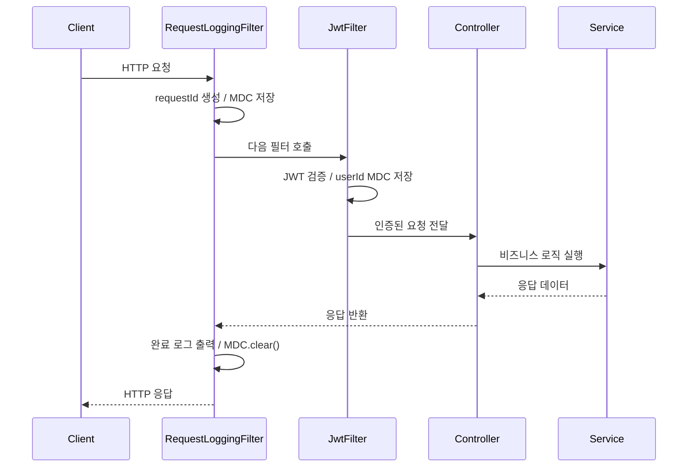
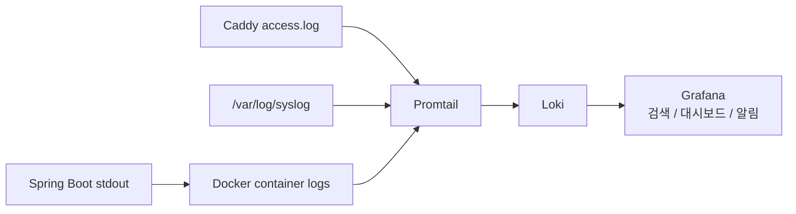

로깅 설계 의도와 정책 기준은 프로젝트 루트의 [`logging-strategy.md`](https://github.com/Olma-Web/OLma-BE/blob/main/logging-strategy.md)를 참고한다. 이 문서는 현재 코드에 실제로 구현된 내용을 기준으로 기술한다.

---

## 필터 구조와 MDC 생명주기

```
RequestLoggingFilter (@Order(1))   -- MDC.put("requestId", ...)
  └─ JwtFilter (@Order(2))         -- MDC.put("userId", ...)
       └─ Controller / Service
  완료 로그 출력 (requestId + userId 모두 MDC에 있음)
  MDC.clear()
```



### RequestLoggingFilter

`src/main/java/com/olma/config/RequestLoggingFilter.java`

- `@Order(1)` — 모든 필터 중 가장 먼저 실행된다.
- 클라이언트가 `X-Request-Id` 헤더를 보내면 해당 값을 사용하고, 없거나 빈 값이면 `UUID.randomUUID().toString().replace("-", "").substring(0, 8)` 로 8자리 ID를 생성한다.
- `MDC.put("requestId", requestId)` 후 `response.setHeader("X-Request-Id", requestId)` 로 응답 헤더에 전파한다.
- `finally` 블록에서 완료 로그를 출력하고 `MDC.clear()` 로 MDC 전체를 정리한다.

완료 로그 레벨 기준:

| HTTP 상태 | 로그 레벨 | 메시지 |
|-----------|-----------|--------|
| 5xx | ERROR | `request failed method=... path=... status=... durationMs=... userId=...` |
| 4xx | WARN | `request completed method=... path=... status=... durationMs=... userId=...` |
| 그 외 | INFO | `request completed method=... path=... status=... durationMs=... userId=...` |

### JwtFilter

`src/main/java/com/olma/config/JwtFilter.java`

- `@Order(2)` — RequestLoggingFilter 다음에 실행된다.
- 인증 성공 시 JWT에서 추출한 userId를 `MDC.put("userId", String.valueOf(userId))` 로 넣는다.
- MDC 정리는 하지 않는다. RequestLoggingFilter의 `finally` 블록이 담당한다.
- 인증 우회 경로: `/v1/auth/`, `/swagger-ui`, `/v3/api-docs`, `/actuator`
- OPTIONS 메서드(CORS preflight)는 인증 없이 통과시킨다.

---

## 로그 패턴

`src/main/resources/application.yaml`:

```yaml
logging:
  pattern:
    console: "%d{yyyy-MM-dd'T'HH:mm:ss.SSSXXX} %5p [%X{requestId:-no-req-id}] [%X{userId:-anonymous}] %logger{36} - %msg%n"
```

출력 예시:

```
2026-06-27T12:34:56.789+09:00  INFO [0f7c] [12] c.o.c.RequestLoggingFilter - request completed method=POST path=/v1/submissions status=201 durationMs=42 userId=12
2026-06-27T12:34:57.012+09:00  WARN [4a91] [anonymous] c.o.c.RequestLoggingFilter - request completed method=POST path=/v1/auth/login status=401 durationMs=18 userId=anonymous
2026-06-27T12:34:58.345+09:00 ERROR [8de2] [12] c.o.c.RequestLoggingFilter - request failed method=GET path=/v1/estimates status=500 durationMs=91 userId=12
```

---

## 로그 레벨 설정

`src/main/resources/application.yaml`:

```yaml
logging:
  level:
    com.olma: INFO
```

`src/main/resources/application-dev.yaml`:

```yaml
logging:
  level:
    com.olma: DEBUG
```

`src/main/resources/application-prod.yaml`:

```yaml
logging:
  level:
    com.olma: INFO
    org.springframework: WARN
```

---

## 예외 로그

`src/main/java/com/olma/controller/GlobalExceptionHandler.java`

| 예외 | 상태 코드 | 로그 레벨 | 로그 형식 |
|------|-----------|-----------|-----------|
| `DataIntegrityViolationException` | 409 | WARN | `Conflict. path={} message={}` |
| `DuplicateValueException` | 409 | WARN | `Conflict. path={} message={}` |
| `InvalidCredentialsException` | 401 | WARN | `Unauthorized. path={} message={}` |
| `NotFoundException` | 404 | WARN | `Not found. path={} message={}` |
| `ForbiddenException` | 403 | WARN | `Forbidden. path={} message={}` |
| `IllegalArgumentException` | 400 | WARN | `Bad request. path={} message={}` |
| `Exception` (미처리) | 500 | ERROR | `Unhandled exception occurred. path={}` + stacktrace |
| `MethodArgumentNotValidException` | 400 | 로그 없음 | `fieldErrors` 포함 응답만 생성 |

---

## 비즈니스 이벤트 로그

### AuthService (`src/main/java/com/olma/service/AuthService.java`)

```java
log.info("user signed up userId={}", user.getId());

log.warn("login failed reason=INVALID_CREDENTIALS");
```

### RateSubmissionService (`src/main/java/com/olma/service/RateSubmissionService.java`)

```java
log.info("rate submission created submissionId={} userId={}", submission.getId(), request.getUserId());
```

### EstimateService (`src/main/java/com/olma/service/EstimateService.java`)

```java
log.info("estimate saved estimateId={} userId={}", savedEstimateId, user.getId());
```

비로그인 사용자의 견적 계산(`calculate()`)은 저장하지 않으므로 로그가 남지 않는다.

### UserProfileService (`src/main/java/com/olma/service/UserProfileService.java`)

```java
log.info("user profile updated userId={}", userId);

log.info("user profile spec progress saved userId={}", userId);

log.info("password changed userId={}", userId);
```

### OutlierMarkingService (`src/main/java/com/olma/service/OutlierMarkingService.java`)

```java
log.info("outlier marking started");

log.info("outlier marking completed rowsTouched={}", affected);

log.error("outlier marking failed", ex);
```

배치 스케줄: 매일 04:00 KST (`@Scheduled(cron = "0 0 4 * * *", zone = "Asia/Seoul")`).

---

## 로그 수집 파이프라인

```
Spring Boot stdout
  -> Docker container logs
  -> Promtail (monitoring/promtail/config.yaml)
  -> Loki (monitoring/loki/config.yaml)
  -> Grafana
```



### Promtail 수집 job 목록

`monitoring/promtail/config.yaml`:

| job_name | 소스 | 설명 |
|----------|------|------|
| `docker` | Docker socket (`unix:///var/run/docker.sock`) | 모든 컨테이너 로그 수집. label: `container`, `image`, `stream` |
| `caddy` | `/var/log/caddy/access.log` | Caddy access log (JSON). label: `status`, `method` |
| `syslog` | `/var/log/syslog` | 시스템 로그 |

Caddy access log는 Promtail pipeline에서 JSON 파싱하여 `status`, `method` 필드를 label로 추출한다.

---

## 현재 구현 상태 체크리스트

1차 구현:

| 항목 | 상태 |
|------|------|
| `RequestLoggingFilter` 추가 | ✅ |
| 모든 요청에 `requestId` 생성/전파 | ✅ |
| `X-Request-Id` 응답 헤더 추가 | ✅ |
| MDC에 `requestId` 추가 | ✅ |
| `JwtFilter` 필터 순서 정리 (`@Order(2)`) | ✅ |
| 로그 패턴에 `requestId`, `userId` 추가 | ✅ |
| 요청 완료 로그 (status 기준 레벨 분기) | ✅ |
| `GlobalExceptionHandler` 예외 로그 추가 | ✅ |
| 핵심 비즈니스 이벤트 로그 추가 | ✅ |
| 배치 작업 시작/완료/실패 로그 | ✅ |

추가 개선 후보:

| 항목 | 상태 |
|------|------|
| JSON structured log 전환 | ⬜ |
| Promtail pipeline에서 Caddy JSON 로그 파싱 | ✅ |
| Spring Boot 로그 JSON 파싱 | ⬜ |
| Grafana 로그 대시보드 개선 | ⬜ |
| Prometheus 기반 Grafana 알림 | ✅ |
| Loki 로그 기반 WARN/ERROR 알림 | ⬜ |
| traceId/spanId 도입 검토 | ⬜ |
