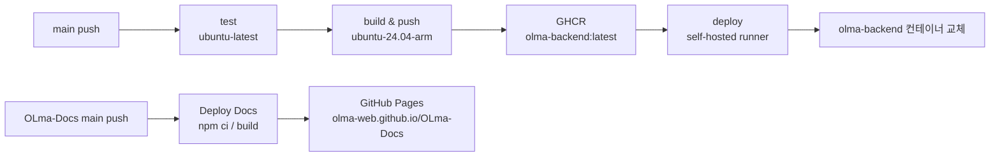
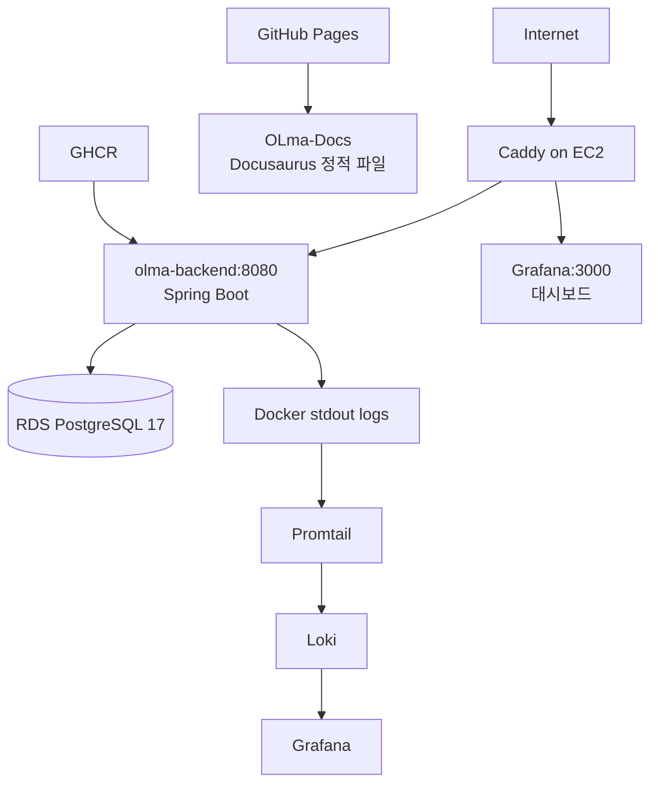
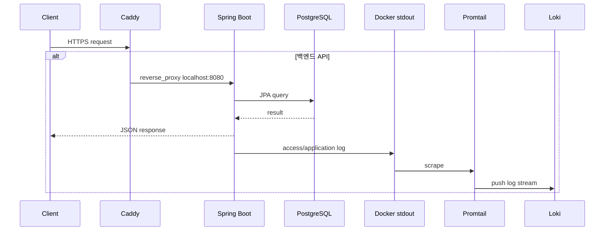

## 전체 배포 흐름

```
main 브랜치 push
  -> GitHub Actions: test (ubuntu-latest)
  -> GitHub Actions: build & push to GHCR (ubuntu-24.04-arm)
  -> GitHub Actions: deploy (self-hosted runner on EC2)        -- 백엔드 컨테이너 교체
  -> OLma-Docs GitHub Actions: Deploy Docs                    -- GitHub Pages 문서 배포
```



백엔드 배포는 GitHub Actions의 `deploy` job이 EC2 위에 올라간 self-hosted runner를 통해 직접 처리한다. 문서 사이트는 `OLma-Docs` 레포지토리의 GitHub Actions가 GitHub Pages로 배포한다. Watchtower 같은 자동 업데이트 도구는 사용하지 않는다.

### Self-hosted runner를 쓰는 이유

`test`/`build` job은 GitHub이 제공하는 호스티드 러너(`ubuntu-latest`, `ubuntu-24.04-arm`)를 쓰지만, 백엔드 실제 배포(`deploy`)는 EC2 내부에 설치된 self-hosted runner가 담당한다. 문서 사이트 배포는 `OLma-Docs` 레포지토리의 GitHub-hosted runner와 GitHub Pages가 담당한다.

- 배포 스크립트가 EC2 "내부"에서 로컬로 실행되므로, GitHub 쪽 시크릿으로는 GitHub가 자동 발급하는 `secrets.GITHUB_TOKEN`(GHCR 로그인용)만 있으면 된다. SSH 개인키나 AWS 자격 증명을 GitHub Secrets에 등록해 외부에서 EC2로 밀어 넣는(push) 구조가 아니다.
- DB 비밀번호, JWT 시크릿 같은 런타임 민감 정보는 GitHub을 거치지 않고 EC2에 이미 있는 `/home/ubuntu/olma.env`(Terraform user_data가 생성)에서 컨테이너로 바로 주입된다.

---

## GitHub Actions 워크플로우

`.github/workflows/ci.yml`

### test job

- 실행 환경: `ubuntu-latest`
- PostgreSQL 17 서비스 컨테이너를 함께 기동한다.
- `./gradlew test` 실행.
- PR과 main 브랜치 push 모두에서 실행된다.

### build job

- 조건: `push` 이벤트이고 브랜치가 `main` 일 때만 실행 (`if: github.event_name == 'push' && github.ref == 'refs/heads/main'`).
- 실행 환경: `ubuntu-24.04-arm` — 이미지가 `linux/arm64` 아키텍처로 빌드된다.
- 이미지명은 `ghcr.io/$(조직명을 소문자로 변환)/olma-backend`로 워크플로우 실행 시 동적으로 계산된다(`github.repository_owner`를 소문자화).
- GHCR에 두 태그로 푸시된다: `:latest`, `:${{ github.sha }}`.

### deploy job (백엔드)

- 실행 환경: `self-hosted` — EC2 인스턴스 위의 GitHub Actions runner.
- 순서:
  1. GHCR에서 `:latest` 이미지 pull.
  2. 기존 `olma-backend` 컨테이너 stop & rm.
  3. 새 컨테이너 기동. `--network monitoring` 으로 Promtail 등 모니터링 컨테이너와 같은 네트워크에 연결.

```yaml
# .github/workflows/ci.yml
deploy:
  needs: build
  runs-on: self-hosted
  steps:
    - name: Pull new image
      run: |
        echo "${{ secrets.GITHUB_TOKEN }}" | docker login ghcr.io -u ${{ github.actor }} --password-stdin
        docker pull ghcr.io/olma-web/olma-backend:latest
    - name: Restart olma-backend
      run: |
        docker network create monitoring 2>/dev/null || true
        docker stop olma-backend && docker rm olma-backend
        docker run -d \
          --name olma-backend \
          --env-file /home/ubuntu/olma.env \
          --network monitoring \
          -p 127.0.0.1:8080:8080 \
          --restart unless-stopped \
          ghcr.io/olma-web/olma-backend:latest
```

### Deploy Docs workflow (문서 사이트)

- 위치: `OLma-Docs/.github/workflows/deploy-docs.yml`
- 조건: `push` 이벤트이고 브랜치가 `main` 일 때 GitHub Pages에 배포한다. PR에서는 빌드 검증만 수행한다.
- 실행 환경: `ubuntu-latest`
- 순서: `npm ci` → `npm run build` → Pages artifact 업로드 → GitHub Pages 배포.
- 배포 URL: `https://olma-web.github.io/OLma-Docs/`

```yaml
# OLma-Docs/.github/workflows/deploy-docs.yml
deploy:
  needs: build
  if: github.event_name != 'pull_request'
  runs-on: ubuntu-latest
  steps:
    - name: Deploy to GitHub Pages
      uses: actions/deploy-pages@v4
```

---

## Docker 이미지 빌드

`Dockerfile`

- 멀티 스테이지 빌드.
  - builder 스테이지: `eclipse-temurin:21-jdk`, `./gradlew bootJar` 실행.
  - 실행 스테이지: `eclipse-temurin:21-jre-alpine`, `spring` 전용 사용자로 실행.
- JVM 옵션: `-XX:+UseG1GC -XX:MaxRAMPercentage=75.0`
- 포트: `8080`

문서 사이트는 Docker 이미지로 빌드되지 않는다. `OLma-Docs`에서 Node.js로 정적 파일을 빌드하고 GitHub Pages가 artifact를 서빙한다.

---

## EC2 인프라

`terraform/main.tf`

| 항목 | 값 |
|------|----|
| 인스턴스 타입 | `t4g.small` (ARM, CPU credits: standard) |
| AMI | Ubuntu 24.04 ARM64 (`ubuntu-noble-24.04-arm64`) |
| 스토리지 | 20GB gp3 |
| 퍼블릭 IP | Elastic IP (EIP) 고정 할당 |
| 리버스 프록시 | Caddy |
| 백엔드 포트 | 8080 (Caddy가 로컬 루프백으로 프록시) |

Caddy는 EC2 user_data로 설치되며, Terraform 기준 `Caddyfile`은 백엔드 API와 Grafana 도메인 블록을 둔다. 각 도메인은 Caddy의 자동 HTTPS 대상이다. 문서 사이트는 GitHub Pages에서 별도로 서빙한다.

```
Caddyfile:
${var.domain} {
  reverse_proxy localhost:8080
}

${var.grafana_domain} {
  reverse_proxy localhost:3000
}
```



### 런타임 요청 경로



---

## RDS

| 항목 | 값 |
|------|----|
| 엔진 | PostgreSQL 17 |
| 인스턴스 클래스 | `var.db_instance_class` (기본값 `db.t4g.micro`, `variables.tf` 참고) |
| 스토리지 | 20GB gp3 |
| 퍼블릭 접근 | 비활성 (`publicly_accessible = false`) |
| 보안 그룹 | `olma-backend-sg` 에서만 5432 포트 접근 허용 |

---

## 환경 변수

백엔드 환경 변수는 EC2 `/home/ubuntu/olma.env` 파일로 관리된다. Terraform user_data에서 초기 생성하며, CI/CD 배포 시 `--env-file /home/ubuntu/olma.env` 로 컨테이너에 전달된다.

| 변수 | 설명 |
|------|------|
| `SPRING_PROFILES_ACTIVE` | `prod` |
| `SPRING_DATASOURCE_URL` | RDS 연결 URL (sslmode=require 포함) |
| `SPRING_DATASOURCE_USERNAME` | DB 사용자명 |
| `SPRING_DATASOURCE_PASSWORD` | DB 비밀번호 |
| `JWT_SECRET` | JWT 서명 시크릿 |

모니터링 환경 변수는 EC2 `/home/ubuntu/monitoring.env` 파일로 관리된다. Terraform user_data에서 초기 생성하며, 모니터링 배포 시 Grafana 컨테이너에 전달된다.

| 변수 | 설명 |
|------|------|
| `DISCORD_WEBHOOK_URL` | Grafana alert Discord webhook URL |

Grafana는 `grafana.olma.kro.kr`에서 Caddy HTTPS를 통해 공개된다. 운영 대시보드는 포트폴리오 확인 목적의 read-only 화면으로 제공하기 위해 anonymous 접근을 허용하고, 로그인 폼과 basic auth는 비활성화한다. anonymous 사용자의 권한은 Grafana `Viewer` 역할로 고정한다.

---

## Watchtower 제거 이유

이전에는 Watchtower를 사용하여 새 이미지를 자동 감지하고 컨테이너를 재기동했다. 이 방식은 다음 이유로 제거되었다.

- EC2 인스턴스가 재생성되면 Terraform user_data가 초기 컨테이너를 기동하는 동시에 Watchtower가 별도로 컨테이너를 교체하는 타이밍 충돌이 발생했다.
- 배포 트리거와 결과를 GitHub Actions 워크플로우에서 단일하게 추적하기 어려웠다.

현재 백엔드는 GitHub Actions의 `deploy` job(self-hosted runner)이 유일한 배포 실행 주체다. 문서 사이트는 `OLma-Docs`의 GitHub Pages workflow가 배포한다. EC2 재생성 후 runner가 재등록되면 이후 백엔드 배포부터 정상 동작한다.

---

## 보안 그룹 인바운드 규칙

`terraform/main.tf` — `aws_security_group.backend`

| 포트 | 프로토콜 | 설명 |
|------|----------|------|
| 22 | TCP | SSH |
| 80 | TCP | HTTP (Caddy — HTTPS 리다이렉트) |
| 443 | TCP | HTTPS (Caddy — 문서 사이트/API/Grafana 도메인) |

백엔드 컨테이너는 `127.0.0.1:8080:8080`으로 바인딩해 Caddy를 통한 접근만 허용한다. 운영 보안 그룹의 외부 인바운드는 22, 80, 443만 사용하며 8080은 직접 공개하지 않는다.
